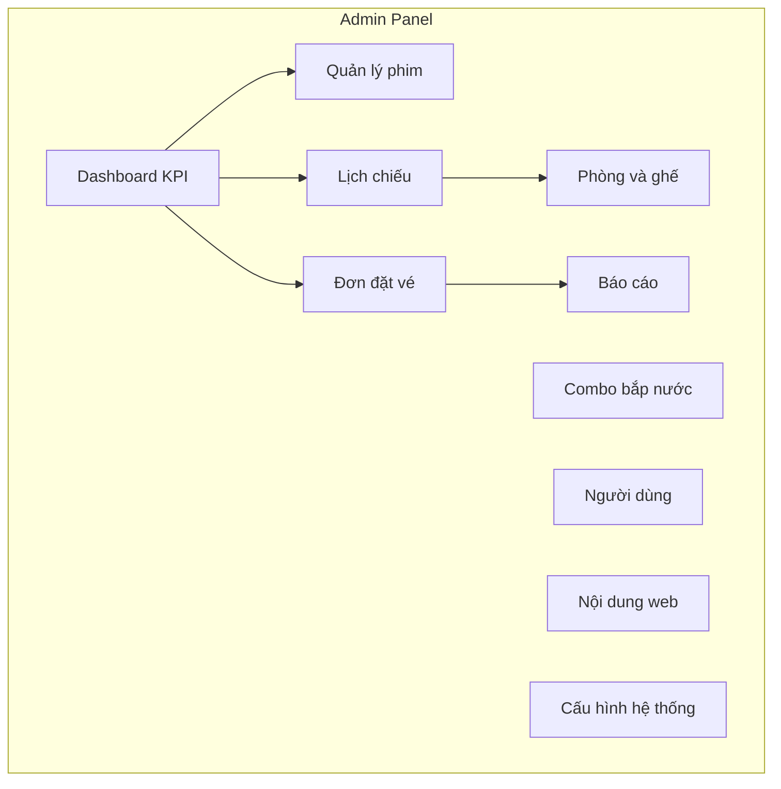
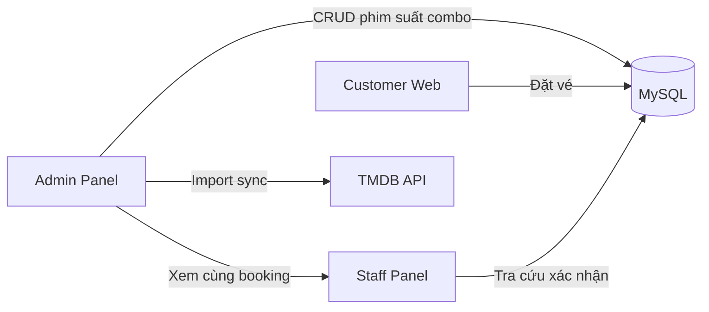

# Kế hoạch phát triển Admin Panel — Smart Cinema

**Dự án:** PTIT_CNTT1_IT210_PROJECTFINAL_CinemaMovieBookingSystem  
**Đối tượng:** Vai trò `ADMIN` — quản trị toàn bộ vận hành rạp  
**Cơ sở:** Phân tích mã nguồn thực tế (`controller/admin/*`, `service/*`, `entity/*`, templates `admin/*`)  
**Ngày lập:** 2026-05-19

> Tài liệu này bổ sung cho [ARCHITECTURE_REPORT.md](ARCHITECTURE_REPORT.md) và [UI_UX_MASTER_PLAN.md](UI_UX_MASTER_PLAN.md). Chỉ liệt kê tính năng có thể xây trên stack hiện tại (Spring Boot 4, Thymeleaf, MySQL, TMDB).

---

## 0. Tóm tắt điều hành

| Khía cạnh | Hiện trạng | Mục tiêu |
|-----------|------------|----------|
| Màn admin có backend | 7 màn (dashboard, phim, import TMDB, suất, báo cáo, hồ sơ) | **25+ màn** vận hành đầy đủ |
| Quản lý user | **Chưa có** (ghi nhận trong `UI_IMPLEMENTATION_PLAN.md`) | CRUD user + phân quyền |
| Quản lý phòng/ghế/combo | Chỉ seed SQL | UI cấu hình + sơ đồ ghế |
| Quản lý đơn vé | Chỉ qua Staff tra cứu | Admin xem/hủy/đối soát |
| Dashboard | 4 card link tĩnh | KPI realtime + cảnh báo |
| Báo cáo | Doanh thu + bảng tháng + top 5 | Biểu đồ, export, nhiều chiều |
| Nội dung marketing | JSON classpath | CMS trong admin (tùy chọn DB) |

**Chiến lược:** Mở rộng theo **module nghiệp vụ** (từ lõi đặt vé → tài nguyên rạp → con người → phân tích), mỗi sprint giao được giá trị vận hành rõ ràng.

---

## 1. Hiện trạng hệ thống Admin (baseline)

### 1.1 Công nghệ & bảo mật

| Thành phần | Chi tiết |
|------------|----------|
| UI | Thymeleaf SSR + **Tailwind CDN** + [`admin-movies.css`](../src/main/resources/static/css/admin/admin-movies.css) |
| Layout | Sidebar cố định [`fragments/admin/sidebar.html`](../src/main/resources/templates/fragments/admin/sidebar.html) |
| Bảo mật | `SecurityConfig`: `/admin/**` → `hasRole('ADMIN')`; `AdminMovieController` có `@PreAuthorize` |
| Ghi chú | `AdminShowtimeController`, `AdminReportController` **chưa** có `@PreAuthorize` class-level — nên bổ sung |

### 1.2 Ma trận chức năng hiện có

| Module | URL / Controller | Chức năng đã có | Thiếu / hạn chế |
|--------|----------------|-----------------|-----------------|
| Tổng quan | `GET /admin/dashboard` | 4 card điều hướng | Không KPI, không biểu đồ |
| Phim rạp | `AdminMovieController` | List, import TMDB, publish, sync runtime, edit fields, activate/deactivate, regenerate schedule | Lọc/tìm, phân trang >100, preview poster, bulk import |
| Suất chiếu | `AdminShowtimeController` | List, tạo mới (`ShowtimeCreateRequest`) | Sửa/hủy suất, lịch dạng calendar, copy suất |
| Báo cáo | `AdminReportController` | Lọc năm/ngày, tổng DT, DT theo tháng, top 5 phim | Query top phim dùng `m.title` (bảng `movies` không có cột title — **cần sửa**) |
| Hồ sơ | `ProfileController` `/admin/profile` | Sửa họ tên, SĐT | — |
| User | — | — | **Toàn bộ module** |
| Phòng / ghế | — | Chỉ `LookupService.listRooms()` cho form suất | CRUD phòng, sơ đồ ghế, loại ghế |
| Combo | — | `ComboRepository` dùng ở checkout khách | CRUD combo, giá, trạng thái |
| Đơn đặt vé | — | Staff tra cứu | Danh sách, chi tiết, hủy, hoàn tiền |
| Thanh toán | — | VNPay sandbox + Payment entity | Đối soát, lọc FAILED/PENDING |
| Cấu hình rạp | — | `CinemaProperties` + `application.properties` | UI sửa `seat-lock-minutes`, VIP multiplier, v.v. |
| Nội dung (KM/tin) | — | `StaticContentService` đọc JSON | Admin soạn thảo nội dung |

### 1.3 Entity / Repository sẵn có (tận dụng cho admin)

```
users, roles, user_profiles
movies (tmdb_id, duration, status, default_base_price, …)
rooms, seats, showtimes, showtime_seats
bookings, tickets, booking_combos, payments
combos
```

Repositories: `UserRepository`, `RoleRepository`, `BookingRepository`, `RoomRepository`, `SeatRepository`, `ComboRepository`, `ShowtimeRepository`, `PaymentRepository`, …

---

## 2. Tầm nhìn & nguyên tắc thiết kế Admin

### 2.1 Mục tiêu sản phẩm

Admin Panel là **trung tâm điều hành** giúp:

1. **Ra mắt phim nhanh** — TMDB import → lịch mẫu → chỉnh giá/suất.
2. **Kiểm soát chỗ ngồi** — phòng, ghế VIP, xung đột suất, sold-out.
3. **Giám sát doanh thu** — đơn PAID/PENDING, đối soát VNPay, báo cáo.
4. **Quản lý con người** — admin, staff, customer (hỗ trợ).
5. **Giảm phụ thuộc SQL/JSON** — cấu hình và nội dung qua UI.

### 2.2 Nguyên tắc UX Admin

| # | Nguyên tắc | Áp dụng |
|---|------------|---------|
| 1 | **Task-first** | Mỗi màn trả lời: "Tôi cần làm gì hôm nay?" (đơn chờ, suất sắp chiếu, phim hết hạn lock) |
| 2 | **An toàn thao tác** | Hủy suất / hủy đơn / ẩn phim → modal xác nhận + ghi chú |
| 3 | **Phản hồi rõ** | Flash toast (`UiToast` đã có phía khách — tái sử dụng admin) |
| 4 | **Bảng + lọc chuẩn** | Mọi list: search, filter, sort, pagination, export CSV |
| 5 | **Đồng bộ TMDB** | Metadata phim luôn hiển thị title/poster từ TMDB (không từ DB) |
| 6 | **Mobile hỗ trợ phụ** | Admin chủ yếu desktop; sidebar thu gọn trên tablet |

### 2.3 Sơ đồ thông tin (Information Architecture)



**Sidebar đề xuất (mở rộng):**

| Nhóm | Menu | Icon |
|------|------|------|
| Tổng quan | Dashboard | tachometer |
| Vận hành | Phim · Lịch chiếu · Phòng & ghế · Combo | film, calendar, chair, popcorn |
| Giao dịch | Đơn đặt vé · Thanh toán | ticket, credit-card |
| Hệ thống | Người dùng · Nội dung · Cấu hình | users, newspaper, cog |
| Phân tích | Báo cáo | chart-line |
| Tài khoản | Hồ sơ · Đăng xuất | user |

---

## 3. Chi tiết module & tính năng phụ trợ

### 3.1 Dashboard vận hành (ưu tiên P0)

**Mục tiêu:** Một màn nhìn thấy sức khỏe rạp trong 30 giây.

| Tính năng | Mô tả | Backend gợi ý |
|-----------|--------|---------------|
| KPI cards | Doanh thu hôm nay / tuần / tháng; số đơn PAID/PENDING; suất hôm nay | `BookingRepository` aggregate queries mới |
| Đơn chờ xử lý | Top 10 booking PENDING quá 10 phút | `findByStatusAndBookingDateBefore` (đã có) |
| Suất sắp diễn | 5 suất gần nhất + % ghế đã bán | `ShowtimeRepository` + `ShowtimeSeatRepository` |
| Phim đang chiếu | Số phim ACTIVE + có suất tương lai | `MovieRepository` |
| Cảnh báo | Ghế lock quá hạn; suất conflict; TMDB sync fail | Scheduler + flag |
| Quick actions | Import phim · Tạo suất · Xem báo cáo | Link |
| Mini chart | Doanh thu 7 ngày (Chart.js CDN) | `sumRevenue` theo ngày |

**File mới:** `AdminDashboardController` mở rộng, `AdminDashboardService`, `templates/admin/dashboard.html` (thay card tĩnh).

---

### 3.2 Quản lý phim rạp (P0 — nâng cấp)

**Hiện có:** [`AdminMovieController`](../src/main/java/com/re/cinemamoviebookingsystem/controller/admin/AdminMovieController.java), `CinemaMovieService`, `MovieService`.

| Tính năng | Mô tả | Độ ưu tiên |
|-----------|--------|------------|
| Tìm kiếm & lọc | Theo title TMDB, `tmdb_id`, status ACTIVE/INACTIVE | P0 |
| Phân trang | Pageable thay vì hardcode 100 | P0 |
| Wizard import TMDB | Bước 1 tìm → 2 preview poster/giá → 3 publish + tạo lịch | P1 |
| Import hàng loạt | Nhập nhiều `tmdb_id` (textarea) | P2 |
| Đồng bộ hàng loạt | Chọn nhiều phim → sync runtime TMDB | P1 |
| Lịch suất inline | Từ list phim → xem suất theo `movieId` | P1 |
| Trạng thái trực quan | Badge ACTIVE/INACTIVE, có/không suất sắp tới | P0 |
| Ghi chú admin | `admin_note` hiển thị trên form (đã có field) | P0 |
| Audit | Lưu `updated_by`, `updated_at` trên `movies` | P2 |

**Tính năng phụ trợ UI:**

- Preview poster/backdrop TMDB trên list (lazy load).
- Nút "Xem trang khách" mở `/customer/movies/{tmdbId}`.
- Xác nhận trước deactivate/regenerate schedule.

---

### 3.3 Quản lý lịch chiếu (P0)

**Hiện có:** Tạo + list; conflict check trong `ShowtimeService.createShowtime`.

| Tính năng | Mô tả | Backend |
|-----------|--------|---------|
| **Lịch tuần (calendar view)** | Lưới phòng × giờ, kéo thả tạo suất (phase 2) hoặc click ô trống | FullCalendar.js + API |
| Sửa suất | Đổi giờ, giá, phòng (nếu chưa có vé) | `ShowtimeUpdateRequest`, service |
| Hủy suất | `ShowtimeStatus.CANCELLED`, thông báo (tùy chọn) | Entity đã có enum |
| Copy suất | Nhân bản sang ngày/phòng khác | Service helper |
| Lọc | Theo phòng, phim, ngày, trạng thái | Repository query |
| Chi tiết suất | Số ghế AVAILABLE/LOCKED/BOOKED, danh sách booking | Join showtime_seats |
| Đánh dấu SOLD_OUT | Thủ công hoặc auto (`ShowtimeStatusService`) | Đã có service |
| Tạo hàng loạt | Chọn phim + khung giờ (10:00, 14:00, 18:00) × N ngày | `ShowtimeScheduleService` mở rộng |
| Cảnh báo xung đột | Hiển thị trước khi submit (AJAX check room) | `existsRoomConflict` |

**Form tạo suất — cải tiến:**

- Autocomplete chọn phim (tmdb_id + title TMDB).
- Date/time picker thống nhất (flatpickr).
- Gợi ý `base_price` từ `movie.defaultBasePrice`.
- Hiển thị `end_time` tính từ duration + cleaning buffer.

---

### 3.4 Quản lý phòng & ghế (P1)

**Hiện có:** Entity `Room`, `Seat`; seed trong `db/seed.sql`; chưa có admin UI.

| Tính năng | Mô tả |
|-----------|--------|
| Danh sách phòng | Tên, tổng ghế, số suất hôm nay |
| Tạo/sửa phòng | `room_name`, `total_seats` (validate) |
| Sơ đồ ghế | Grid editor: hàng × số ghế, đặt STANDARD/VIP |
| Tạo ghế hàng loạt | Nhập số hàng, ghế/hàng, pattern VIP (vd. hàng J–K VIP) |
| Khóa ghế bảo trì | Trạng thái ghế `MAINTENANCE` (cần mở rộng enum + schema) |
| Xem occupancy | Heatmap ghế theo suất (màu booked %) |

**Lưu ý:** Thay đổi layout ghế **không** được phép nếu đã có suất/booking — chỉ cho sửa khi phòng mới hoặc chưa có showtime.

**File mới:** `AdminRoomController`, `AdminSeatController`, `RoomService`, `SeatLayoutService`.

---

### 3.5 Quản lý combo bắp nước (P1)

**Hiện có:** Bảng `combos`; khách chọn lúc checkout.

| Tính năng | Mô tả |
|-----------|--------|
| CRUD combo | name, description, price, status ACTIVE/INACTIVE |
| Upload ảnh combo | Lưu `static/` hoặc URL |
| Thống kê | Top combo bán chạy theo `booking_combos` |
| Gói khuyến mãi | Giảm % khi mua combo (phase 2) |

**File mới:** `AdminComboController`, `ComboService`.

---

### 3.6 Quản lý đơn đặt vé & thanh toán (P0)

**Hiện có:** Staff tra cứu theo mã; admin chưa có list.

| Tính năng | Mô tả |
|-----------|--------|
| Danh sách đơn | Lọc: trạng thái, ngày, phim, user, phòng; sort; pagination |
| Chi tiết đơn | User, suất, ghế, combo, payment, ticket codes |
| Hủy đơn (admin) | Gọi `BookingService.cancelBooking` + policy |
| Xác nhận quầy | Tương tự staff `confirmPaymentAtCounter` |
| In vé / export PDF | Tái sử dụng `staff/print-ticket.html` |
| Đối soát VNPay | List payment PENDING/FAILED; retry callback |
| Hoàn tiền (manual) | Ghi nhận trạng thái (phase 2 — chưa tích hợp cổng thật) |
| Gửi email vé | Kích hoạt `EmailNotificationService` thật (SMTP) |

**File mới:** `AdminBookingController`, `AdminPaymentController`, `AdminBookingService`.

**Tích hợp Staff:** Staff giữ tra cứu nhanh; Admin có view đầy đủ + báo cáo.

---

### 3.7 Quản lý người dùng & phân quyền (P0)

**Hiện có:** `User`, `Role`, `UserProfile`; `AuthService.register`; **không** có admin CRUD.

| Tính năng | Mô tả |
|-----------|--------|
| Danh sách user | Lọc theo role ADMIN/STAFF/CUSTOMER |
| Tạo staff/admin | Username, email, role, password tạm (BCrypt) |
| Khóa / mở khóa | Flag `enabled` (cần thêm cột) hoặc đổi role |
| Reset mật khẩu | Admin đặt password mới |
| Sửa profile | full_name, phone |
| Lịch sử đặt vé | Link tới booking list filter by user |
| Đăng ký customer | Chỉ xem, không xóa cứng (soft delete) |

**Bảo mật:**

- Chỉ ADMIN truy cập `/admin/users/**`.
- Không cho admin tự hạ quyền chính mình.
- Log hành động nhạy cảm (reset pass).

**File mới:** `AdminUserController`, `AdminUserService`, DTO `UserCreateRequest`, `UserUpdateRequest`.

---

### 3.8 Quản lý nội dung website (P2)

**Hiện có:** `database/promotion.json`, `event.json`, `festival.json` qua `StaticContentService`.

| Phương án | Ưu | Nhược |
|-----------|-----|-------|
| A. Giữ JSON + admin form ghi file | Nhanh, ít migration | Khó deploy đa môi trường |
| B. Chuyển sang bảng `content_articles` | Chuẩn CMS, audit | Migration + entity mới |

**Tính năng (phương án B khuyến nghị dài hạn):**

- CRUD bài KM / tin / festival: title, slug, body HTML, ảnh, publish date, active.
- Editor WYSIWYG nhẹ (TinyMCE CDN hoặc markdown).
- Preview trang khách.

---

### 3.9 Báo cáo & phân tích (P1 — nâng cấp)

**Hiện có:** [`ReportService`](../src/main/java/com/re/cinemamoviebookingsystem/service/ReportService.java), [`reports.html`](../src/main/resources/templates/admin/reports.html).

| Tính năng | Mô tả |
|-----------|--------|
| **Sửa bug top phim** | Join `movies.tmdb_id` + resolve title qua TMDB hoặc lưu cache title |
| Biểu đồ cột | Doanh thu theo tháng (Chart.js) |
| Biểu đồ tròn | Doanh thu theo phòng / theo combo |
| Báo cáo suất | Suất nào fill rate cao nhất |
| Báo cáo ghế | VIP vs STANDARD doanh thu |
| Export Excel/CSV | Doanh thu, đơn, suất |
| So sánh kỳ | Tháng này vs tháng trước (%) |
| In báo cáo | Print-friendly CSS |

**Báo cáo bổ sung đề xuất:**

| Mã báo cáo | Nội dung |
|------------|----------|
| R01 | Doanh thu theo khoảng thời gian |
| R02 | Top phim (theo TMDB title) |
| R03 | Top phòng |
| R04 | Top combo |
| R05 | Tỷ lệ hủy đơn |
| R06 | Thời gian thanh toán trung bình (PENDING → PAID) |
| R07 | Khung giờ đông khách (heatmap) |

---

### 3.10 Cấu hình hệ thống (P1)

**Hiện có:** [`CinemaProperties`](../src/main/java/com/re/cinemamoviebookingsystem/config/CinemaProperties.java), `application.properties`.

| Nhóm cấu hình | Thuộc tính | UI |
|---------------|------------|-----|
| Đặt vé | `seat-lock-minutes`, `max-seats-per-booking`, `cancel-hours-before` | Form số |
| Giá | `vip-price-multiplier` | Form |
| Vận hành | `cleaning-buffer-minutes` | Form |
| TMDB | `tmdb.api-key` (mask), test connection | Form + nút Test |
| Demo seed | `demo-seed-on-startup`, targets | Toggle (chỉ dev) |

**Kỹ thuật:** Lưu DB bảng `system_settings` (key-value) hoặc ghi `application-local` qua admin (cần restart — ghi chú rõ).

---

### 3.11 Tính năng xuyên suốt (Cross-cutting) — nên có trên mọi module

| Tính năng | Mô tả | Công nghệ |
|-----------|--------|-----------|
| Toast thông báo | Success/error sau POST | `UiToast` + flash attributes |
| Modal xác nhận | Xóa, hủy, deactivate | `ui-components.css` |
| Breadcrumb | Admin > Module > Chi tiết | Fragment |
| Tìm kiếm toàn cục | Omnibox: phim, đơn, user (phase 2) | Lucene hoặc SQL LIKE |
| Nhật ký hoạt động (Audit log) | Ai đổi giá suất, ai hủy đơn | Bảng `audit_logs` |
| Phân trang chuẩn | Page size 20/50 | Spring Data Pageable |
| Export CSV | Mọi bảng list | OpenCSV / manual |
| Dark mode admin | Tùy chọn | `data-theme` tái sử dụng |
| i18n admin | VI/EN cho label | `messages.properties` |
| Phím tắt | `/` focus search, `?` help | JS nhẹ |
| Health widget | DB OK, TMDB OK, disk | Actuator (tùy chọn) |

---

## 4. Kiến trúc kỹ thuật đề xuất

### 4.1 Cấu trúc package (mở rộng)

```
controller/admin/
  AdminDashboardController.java      (mở rộng)
  AdminMovieController.java          (có sẵn)
  AdminShowtimeController.java       (mở rộng)
  AdminRoomController.java           (mới)
  AdminComboController.java          (mới)
  AdminBookingController.java        (mới)
  AdminUserController.java           (mới)
  AdminReportController.java         (mở rộng)
  AdminSettingsController.java       (mới)
  AdminContentController.java        (mới, phase 3)

service/
  AdminDashboardService.java
  AdminUserService.java
  AdminBookingService.java
  RoomService.java
  ComboService.java
  AuditLogService.java
  ...

dto/request/admin/...
dto/response/admin/...

templates/admin/
  dashboard.html
  movies/...
  showtimes/
    list.html, form.html, calendar.html
  rooms/
  seats/
  bookings/
  users/
  combos/
  reports/
  settings/
  fragments/
    sidebar.html (mở rộng)
    admin-head.html
    data-table.html
    confirm-modal.html
```

### 4.2 Chuẩn hóa UI Admin

| Thành phần | Hành động |
|------------|-----------|
| Design tokens | Tái sử dụng [`design-tokens.css`](../src/main/resources/static/css/common/design-tokens.css) + file `admin-tokens.css` |
| Component | Data table, filter bar, stat card, empty state |
| Chart | Chart.js 4 CDN chỉ trên dashboard/reports |
| Form validation | Bean Validation + hiển thị lỗi field-level |

### 4.3 REST API admin (tùy chọn phase 3)

Nếu cần dashboard realtime không reload:

- Prefix `/api/admin/**` + JWT/session (cùng Spring Security).
- Dùng cho calendar AJAX, chart data, conflict check.

**Mặc định đề xuất:** Giữ **Thymeleaf SSR** (đồng bộ codebase) trừ vài endpoint JSON.

---

## 5. Lộ trình triển khai (10 sprint × ~1 tuần)

### Sprint A1 — Nền admin & Dashboard KPI (P0)

| # | Deliverable |
|---|-------------|
| A1.1 | `@PreAuthorize` cho mọi admin controller |
| A1.2 | Sidebar mới (nhóm menu) + layout admin thống nhất |
| A1.3 | `AdminDashboardService` + KPI cards + đơn PENDING |
| A1.4 | Toast + modal xác nhận trên admin |
| A1.5 | Sửa query top phim báo cáo (TMDB title) |

### Sprint A2 — Quản lý đơn & thanh toán (P0)

| # | Deliverable |
|---|-------------|
| A2.1 | `AdminBookingController` list + filter + detail |
| A2.2 | Hủy đơn / xác nhận quầy từ admin |
| A2.3 | `AdminPaymentController` list đối soát |
| A2.4 | Link từ dashboard → đơn chờ |

### Sprint A3 — Quản lý người dùng (P0)

| # | Deliverable |
|---|-------------|
| A3.1 | CRUD user + role |
| A3.2 | Reset password + enabled flag |
| A3.3 | Tạo tài khoản STAFF |

### Sprint A4 — Phim & TMDB nâng cao (P1)

| # | Deliverable |
|---|-------------|
| A4.1 | Search/filter/pagination list phim |
| A4.2 | Wizard import TMDB 3 bước |
| A4.3 | Bulk sync runtime |
| A4.4 | Inline list suất theo phim |

### Sprint A5 — Lịch chiếu nâng cao (P1)

| # | Deliverable |
|---|-------------|
| A5.1 | Sửa/hủy suất |
| A5.2 | Lọc list suất nâng cao |
| A5.3 | Chi tiết suất (occupancy) |
| A5.4 | AJAX conflict check trên form |
| A5.5 | Tạo suất hàng loạt (khung giờ × ngày) |

### Sprint A6 — Phòng, ghế & Combo (P1)

| # | Deliverable |
|---|-------------|
| A6.1 | CRUD phòng |
| A6.2 | Seat grid editor (cơ bản) |
| A6.3 | CRUD combo |

### Sprint A7 — Báo cáo & Export (P1)

| # | Deliverable |
|---|-------------|
| A7.1 | Chart.js doanh thu |
| A7.2 | Báo cáo R03–R05 |
| A7.3 | Export CSV đơn + doanh thu |

### Sprint A8 — Cấu hình & Audit (P2)

| # | Deliverable |
|---|-------------|
| A8.1 | UI `CinemaProperties` / system_settings |
| A8.2 | Audit log cho thao tác nhạy cảm |
| A8.3 | TMDB test connection |

### Sprint A9 — Lịch calendar view (P2)

| # | Deliverable |
|---|-------------|
| A9.1 | Calendar view tuần theo phòng |
| A9.2 | Click tạo suất từ ô trống |

### Sprint A10 — CMS nội dung (P2)

| # | Deliverable |
|---|-------------|
| A10.1 | Entity `content_articles` + migration |
| A10.2 | CRUD KM/tin/festival |
| A10.3 | Migrate JSON → DB |

---

## 6. Ma trận ưu tiên (Impact × Effort)

```
Impact cao, Effort thấp (Làm trước):
  - Dashboard KPI + đơn PENDING
  - Admin booking list/detail
  - Sửa bug top phim report
  - @PreAuthorize đồng bộ
  - Toast/modal admin

Impact cao, Effort cao:
  - User management
  - Calendar lịch chiếu
  - Seat grid editor
  - CMS nội dung

Impact thấp, Effort thấp:
  - Export CSV
  - Breadcrumb admin
  - Dark mode admin

Impact thấp, Effort cao:
  - Omnibox search toàn cục
  - Hoàn tiền online thật
```

---

## 7. Mở rộng cơ sở dữ liệu (đề xuất)

| Bảng mới | Mục đích |
|----------|----------|
| `audit_logs` | user_id, action, entity, entity_id, payload, created_at |
| `system_settings` | key, value, updated_at |
| `content_articles` | type, title, slug, body, image_url, published_at, active |
| `users.enabled` | Cột bổ sung (hoặc status ENUM) |

**Không bắt buộc ngay:** Có thể triển khai P0–P1 chỉ với schema hiện tại.

---

## 8. Tích hợp với Customer & Staff



| Luồng | Admin | Staff | Customer |
|-------|-------|-------|----------|
| Đặt vé online | Xem/hủy đơn | — | Checkout |
| Đặt quầy | Xác nhận | Confirm payment | — |
| Phim mới | Import TMDB | — | Xem catalog |
| Suất mới | Tạo suất | — | Chọn ghế |
| Báo cáo | Full | — | — |

---

## 9. Rủi ro & giảm thiểu

| Rủi ro | Giảm thiểu |
|--------|------------|
| Sửa ghế khi đã có booking | Chặn edit layout; chỉ đổi trạng thái maintenance |
| Hủy suất có vé | Chỉ cho hủy khi chưa có PAID booking |
| TMDB rate limit | Cache Caffeine (đã có) + backoff |
| Admin xóa nhầm user | Soft delete + confirm |
| Báo cáo sai title | Fix query dùng TMDB/cache |
| Scope creep | Bám sprint; P2 có thể cắt CMS |

---

## 10. Tiêu chí hoàn thành (Definition of Done)

- [ ] CRUD hoàn chỉnh với validation + flash message
- [ ] `@PreAuthorize("hasRole('ADMIN')")` trên controller
- [ ] List có pagination + ít nhất 1 filter
- [ ] Thao tác phá hủy có modal xác nhận
- [ ] Responsive table (scroll ngang mobile)
- [ ] Không regression customer booking flow
- [ ] `compileJava` + smoke test thủ công

---

## 11. Chỉ số thành công (KPI vận hành)

| KPI | Mục tiêu |
|-----|----------|
| Thời gian publish phim mới | < 5 phút (TMDB → có suất) |
| Thao tác admin không cần SQL | 95% tác vụ qua UI |
| Đơn PENDING xử lý | < 15 phút trung bình |
| Lỗi xung đột suất | Giảm 90% (nhờ check AJAX) |
| Báo cáo doanh thu | Khớp với tổng đơn PAID (đối soát) |

---

## 12. Bước tiếp theo đề xuất

1. **Phê duyệt** phạm vi Sprint A1–A3 (P0) cho đồ án / demo PTIT.  
2. **Sửa nhanh** bug `topMoviesByRevenue` (title phim).  
3. **Triển khai** `AdminBookingController` + Dashboard KPI — giá trị demo cao nhất.  
4. Song song: mở rộng sidebar và design system admin (tái dùng tokens đã có).

---

*Tài liệu tham chiếu mã nguồn — Smart Cinema Admin Development Plan.*
