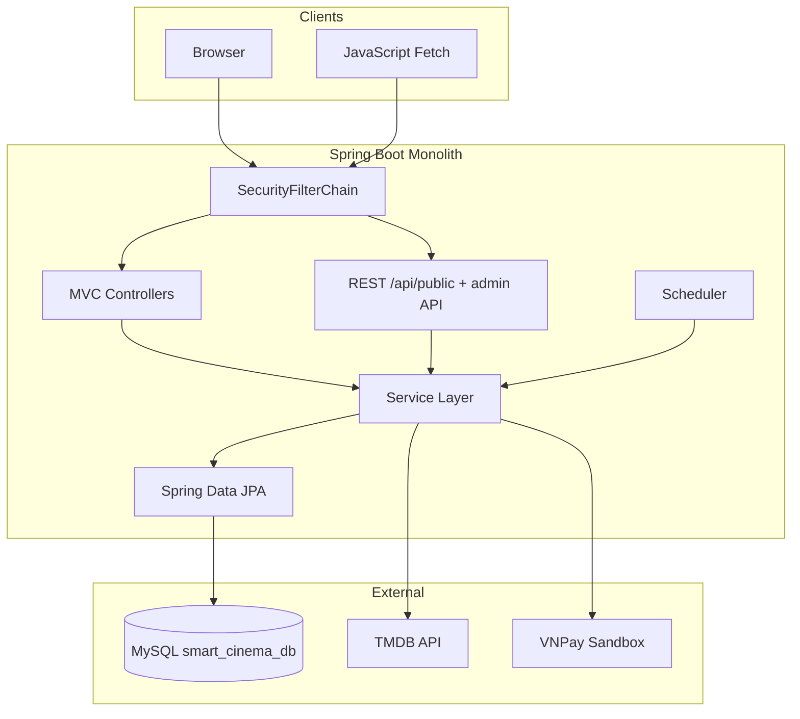
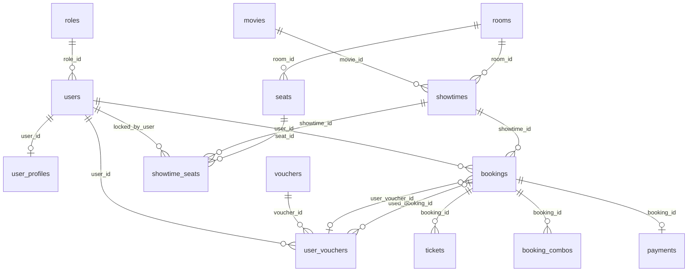
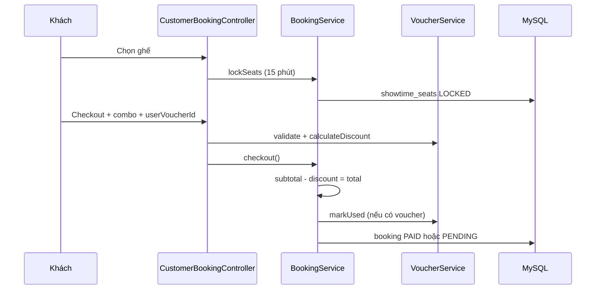

# Báo cáo kiến trúc & tổng hợp triển khai — Smart Cinema Movie Booking

**Dự án:** PTIT_CNTT1_IT210_PROJECTFINAL_CinemaMovieBookingSystem  
**Package gốc:** `com.re.cinemamoviebookingsystem`  
**Thương hiệu:** Smart Cinema  
**Cơ sở dữ liệu:** `smart_cinema_db` (MySQL)  
**Cổng mặc định:** `8081`  
**Cập nhật tài liệu:** 2026 — bao gồm voucher, auth redesign, lịch chiếu async, tạo suất hàng loạt (validate ngày/giờ)

> Tài liệu trích từ mã nguồn và cấu hình trong repository. Dùng làm **báo cáo đồ án / thuyết trình** cho giảng viên hướng dẫn.

---

## Mục lục

1. [Tổng quan dự án](#1-tổng-quan-dự-án)
2. [Công nghệ & thư viện](#2-công-nghệ--thư-viện)
3. [Kiến trúc phần mềm](#3-kiến-trúc-phần-mềm)
4. [Cơ sở dữ liệu](#4-cơ-sở-dữ-liệu)
5. [Tính năng đã triển khai (chi tiết)](#5-tính-năng-đã-triển-khai-chi-tiết)
6. [API REST & luồng nghiệp vụ](#6-api-rest--luồng-nghiệp-vụ)
7. [Bảo mật, validation & i18n](#7-bảo-mật-validation--i18n)
8. [Giao diện & frontend](#8-giao-diện--frontend)
9. [Kiểm thử & vận hành](#9-kiểm-thử--vận-hành)
10. [Cấu trúc thư mục](#10-cấu-trúc-thư-mục)
11. [Gợi ý trình bày báo cáo](#11-gợi-ý-trình-bày-báo-cáo)
12. [Phụ lục](#12-phụ-lục)

---

## 1. Tổng quan dự án

### 1.1 Mục tiêu

Xây dựng **hệ thống đặt vé rạp chiếu phim trực tuyến** với ba vai:

| Vai trò | Mô tả |
|---------|--------|
| **CUSTOMER** | Xem phim/lịch chiếu, chọn ghế, combo, voucher, thanh toán online hoặc quầy, quản lý vé & tài khoản |
| **ADMIN** | Quản lý phim (TMDB), suất chiếu, phòng, combo, đơn, user, báo cáo, nội dung, cài đặt |
| **STAFF** | Tra cứu vé, xác nhận thanh toán tại quầy, in vé |

### 1.2 Đặc điểm kỹ thuật nổi bật

- **Monolith Spring Boot** — SSR (Thymeleaf) + REST JSON song song
- **TMDB-first** — metadata phim (poster, title, trailer) lấy từ API; DB chỉ lưu `tmdb_id` + thông tin rạp
- **Lock ghế có TTL** — pessimistic lock + scheduler giải phóng
- **Cache Caffeine** — giảm gọi TMDB
- **Đa ngôn ngữ** — Tiếng Việt / English (`messages.properties`)
- **Voucher ví khách** — giảm % / cố định, gắn đơn, hoàn trả khi hủy

### 1.3 Điểm khởi động

`PtitCntt1It210ProjectfinalCinemaMovieBookingSystemApplication.java`  
`@SpringBootApplication`, `@EnableScheduling`, `@EnableAsync`

---

## 2. Công nghệ & thư viện

### 2.1 Nền tảng cốt lõi

| Thành phần | Phiên bản / Giá trị | Nguồn |
|------------|---------------------|--------|
| Ngôn ngữ | **Java 21** | `build.gradle` |
| Build tool | **Gradle 9.4.1** | `gradle/wrapper/` |
| Framework | **Spring Boot 4.0.6** | `build.gradle` |
| ORM | **Spring Data JPA / Hibernate** | `spring-boot-starter-data-jpa` |
| CSDL | **MySQL** (`mysql-connector-j`) | `application.properties` |
| View | **Thymeleaf 3.x** | `spring-boot-starter-thymeleaf` |
| Bảo mật | **Spring Security 6** | Form login, role-based |

### 2.2 Dependencies Maven/Gradle (vai trò)

| Thư viện | Vai trò trong dự án |
|----------|---------------------|
| `spring-boot-starter-webmvc` | MVC controller, REST API |
| `spring-boot-starter-validation` | `@Valid`, `@NotNull`, `@AssertTrue`, Bean Validation |
| `spring-boot-starter-security` | Phân quyền URL, BCrypt, CSRF |
| `thymeleaf-extras-springsecurity6` | Hiển thị menu/theo role trên template |
| `spring-boot-starter-cache` + **Caffeine** | Cache TMDB 30 phút (`CacheConfig`) |
| `jackson-databind` | JSON API, deserialize TMDB |
| **Lombok** | Entity, DTO, `@Builder`, `@RequiredArgsConstructor` |
| `spring-boot-devtools` | Hot reload khi dev |
| **JUnit 5** + **H2** (test) | Unit / integration test |
| **Mockito** | Mock service trong test |

### 2.3 Tích hợp ngoài (không qua SDK Maven riêng)

| Dịch vụ | Triển khai | File tham chiếu |
|---------|-----------|-----------------|
| **TMDB API** | HTTP client tự viết (`RestTemplate` / client custom) | `tmdb/client/TmdbClient.java`, `TmdbCatalogService` |
| **VNPay Sandbox** | URL thanh toán + callback tự viết | `VnPaySandboxService.java`, `PaymentController` |

### 2.4 Frontend (không dùng React/Vue SPA riêng)

| Công nghệ | Vai trò |
|-----------|---------|
| HTML5 + **Thymeleaf** | Server-side render |
| **CSS3** | Customer (dark theme), admin (Tailwind-style utility) |
| **JavaScript thuần** | Ghế, checkout, lịch async, admin calendar/list |
| **Font Awesome** | Icon |
| **Fetch API** | Gọi `/api/public/*`, voucher preview |

### 2.5 Chiến lược schema & dữ liệu

| Cơ chế | Cấu hình | Hành vi |
|--------|----------|---------|
| Hibernate DDL | `ddl-auto=update` | Tự tạo/sửa bảng từ Entity |
| SQL seed | `spring.sql.init.mode=always` + `db/seed.sql` | `INSERT IGNORE` — chạy lại an toàn |
| Schema tham chiếu | `db/schema.sql` | Import thủ công MySQL Workbench |
| Demo TMDB | `cinema.demo-seed-on-startup=true` | `CinemaDemoSeedRunner` |
| Voucher demo | `VoucherDemoSeedRunner` | Seed voucher khi bảng trống |
| Seat lock cleanup | `@Scheduled` 60s | `SeatLockScheduler` → `releaseExpiredLocks()` |
| Sửa conflict suất | `cinema.repair-showtime-conflicts-on-startup` | `ShowtimeConflictRepairRunner` |

### 2.6 Cấu hình nghiệp vụ rạp (`cinema.*`)

| Thuộc tính | Giá trị | Ý nghĩa |
|------------|---------|---------|
| `brand-name` | Smart Cinema | Tên hiển thị |
| `seat-lock-minutes` | 15 | Thời gian giữ ghế LOCKED |
| `cancel-hours-before` | 24 | Hủy vé trước giờ chiếu |
| `cleaning-buffer-minutes` | 15 | Khoảng cách giữa suất cùng phòng |
| `vip-price-multiplier` | 1.5 | Hệ số giá ghế VIP |
| `max-seats-per-booking` | 8 | Số ghế tối đa / đơn |
| `upload-dir` | uploads | Avatar upload |
| `demo-seed-waiting-target` | 100 | Phim TMDB «đợi lịch» |

### 2.7 TMDB

| Thuộc tính | Giá trị |
|------------|---------|
| `tmdb.base-url` | `https://api.themoviedb.org/3` |
| `tmdb.api-key` / `bearer-token` | `application-local.properties` hoặc env |
| `tmdb.image-base` | `https://image.tmdb.org/t/p/` |
| Cache | Caffeine — key theo endpoint + ngôn ngữ |

---

## 3. Kiến trúc phần mềm

### 3.1 Sơ đồ tổng thể



### 3.2 Phân lớp

| Lớp | Package | Trách nhiệm |
|-----|---------|-------------|
| **Presentation** | `controller/`, `api/` | HTTP, Model, redirect, JSON |
| **Business** | `service/` | Transaction, rule, orchestration |
| **Persistence** | `repository/`, `entity/` | JPA, query, lock |
| **Integration** | `tmdb/` | TMDB client & DTO |
| **Cross-cutting** | `config/`, `security/`, `exception/`, `validation/` | Security, cache, locale, lỗi |
| **View** | `templates/`, `static/` | Thymeleaf, CSS, JS |

**Chuyển đổi DTO:** Không dùng MapStruct — Entity → DTO trong Service qua Lombok `@Builder`.

### 3.3 Hai kênh giao tiếp

| Kênh | Công nghệ | Ví dụ |
|------|-----------|-------|
| **SSR** | Thymeleaf + form POST | Đặt vé, admin CRUD, login |
| **REST JSON** | `@RestController` | Catalog TMDB, lịch chiếu async, admin calendar API |

---

## 4. Cơ sở dữ liệu

### 4.1 Danh sách bảng / Entity (19 entity)

| Bảng | Entity | Mô tả |
|------|--------|--------|
| `roles` | `Role` | ADMIN, STAFF, CUSTOMER |
| `users` | `User` | Tài khoản, `auth_provider` |
| `user_profiles` | `UserProfile` | Họ tên, SĐT, avatar |
| `movies` | `Movie` | **TMDB-first**: `tmdb_id`, duration, status, giá mặc định |
| `rooms` | `Room` | Phòng chiếu |
| `seats` | `Seat` | STANDARD / VIP |
| `showtimes` | `Showtime` | Suất: movie, room, start/end, giá |
| `showtime_seats` | `ShowtimeSeat` | AVAILABLE / LOCKED / BOOKED + lock TTL |
| `combos` | `Combo` | Combo bắp nước |
| `bookings` | `Booking` | Đơn + **subtotal**, **discount**, **user_voucher_id** |
| `tickets` | `Ticket` | Vé từng ghế + `ticket_code` (UUID) |
| `booking_combos` | `BookingCombo` | Khóa (booking_id, combo_id) |
| `payments` | `Payment` | 1-1 booking; ONLINE / CASH |
| `vouchers` | `Voucher` | Mã giảm: PERCENT / FIXED, điều kiện |
| `user_vouchers` | `UserVoucher` | Ví voucher từng user |
| `content_articles` | `ContentArticle` | PROMOTION / NEWS / FESTIVAL |
| `audit_logs` | `AuditLog` | Nhật ký admin |

### 4.2 Sơ đồ quan hệ (mở rộng voucher)



### 4.3 Enum nghiệp vụ (`enums/`)

| Enum | Giá trị | Dùng cho |
|------|---------|----------|
| `BookingStatus` | HELD, PENDING, PAID, CANCELLED | Đơn đặt vé |
| `SeatStatus` | AVAILABLE, LOCKED, BOOKED | Ghế theo suất |
| `ShowtimeStatus` | ACTIVE, SOLD_OUT, HIDDEN, CANCELLED | Suất chiếu |
| `PaymentStatus` | PENDING, SUCCESS, FAILED | Thanh toán |
| `PaymentMode` | ONLINE, COUNTER | Checkout |
| `PhysicalSeatType` | STANDARD, VIP | Giá ghế |
| `DiscountType` | PERCENT, FIXED | Voucher |
| `UserVoucherStatus` | AVAILABLE, USED, EXPIRED | Ví voucher |
| `VoucherStatus` | ACTIVE, INACTIVE | Mã master |
| `ContentCategory` | PROMOTION, NEWS, FESTIVAL | Bài viết |

### 4.4 Ràng buộc quan trọng

- **Movie:** `tmdb_id` UNIQUE; không lưu title/poster trong DB
- **Showtime conflict:** query overlap `(room_id, start_time, end_time)` + buffer dọn phòng
- **Booking:** `total_amount` = sau giảm voucher; `subtotal_amount` = vé + combo trước giảm
- **Voucher:** Một `user_voucher` USED gắn một booking; hủy đơn → restore AVAILABLE

### 4.5 Kết nối DB

```
jdbc:mysql://localhost:3306/smart_cinema_db
?createDatabaseIfNotExist=true
&serverTimezone=Asia/Ho_Chi_Minh
```

> Mật khẩu DB nên đặt trong `application-local.properties` (gitignored), không commit plaintext.

---

## 5. Tính năng đã triển khai (chi tiết)

Phần này tổng hợp **toàn bộ chức năng** trong hệ thống, nhấn mạnh các hạng mục đã hoàn thiện / cải tiến gần đây.

### 5.1 Khách hàng (CUSTOMER)

#### 5.1.1 Trang chủ & catalog

| Tính năng | Mô tả kỹ thuật |
|-----------|----------------|
| Trang chủ | Phim đang chiếu, sắp chiếu, hero banner (`HeroBannerService`, `TmdbHomeCatalogService`) |
| Catalog TMDB | Trang duyệt phim qua `/api/public/movies/*` + JS |
| Chi tiết phim | Metadata TMDB + suất theo ngày (`CustomerMovieController`) |
| Sidebar carousel | 3 thẻ/slide (khuyến mãi, tin, lễ hội), pagination, **auto-advance ~4.5s** |
| Promo modal | Modal nhỏ, nền sáng hơn (`home-promo.css`) |
| Đa ngôn ngữ | `CustomerLanguageController`, `messages.properties` / `messages_en.properties` |

**File liên quan:** `home.html`, `fragments/customer/home-sidebar-carousel.html`, `home-sidebar-carousel.css`, `HomeFeaturedContentService`, `CustomerSchedulePageService`

#### 5.1.2 Lịch chiếu (async)

| Trước | Sau |
|-------|-----|
| Server render toàn bộ suất + TMDB khi GET | **Shell HTML** nhẹ, không block header |
| Full page reload khi lọc | **Fetch** `GET /api/public/schedule` |

| Thành phần | File |
|------------|------|
| Controller shell | `CustomerMovieController.calendar()` |
| API | `PublicScheduleController`, `SchedulePageApiResponse` |
| Service | `CustomerSchedulePageService` |
| Frontend | `calendar.html`, `calendar-page.js` |

#### 5.1.3 Đặt vé & ghế

| Tính năng | Chi tiết |
|-----------|----------|
| Sơ đồ ghế | `ShowtimeService.getSeatMap`, nhóm theo hàng (`SeatLayoutHelper`) |
| Lock ghế | `BookingService.lockSeats` — pessimistic lock, `locked_until` |
| Đồng bộ ghế | `POST .../seats/sync-lock` — chọn/bỏ không reload |
| Countdown | Hiển thị thời gian còn lại giữ ghế |
| Chưa login | `BookingResumeSession` → login → `resumeBooking` |
| Giá VIP | `vip-price-multiplier` × `base_price` |

**File:** `CustomerBookingController`, `BookingService`, `seat-booking.js`, `seats.html`

#### 5.1.4 Thanh toán & voucher

| Tính năng | Chi tiết |
|-----------|----------|
| Combo | Số lượng từng combo, cộng vào subtotal |
| Phương thức | VietQR, VNPay, MoMo, Viettel (UI), **thanh toán quầy** |
| **Voucher ví** | Chọn từ danh sách thẻ (không gõ mã tay) |
| **Đề xuất** | Badge trên voucher tiết kiệm nhiều nhất |
| Preview giảm | `GET /customer/checkout/voucher-preview` |
| Tổng tiền realtime | `ui-only.js` — subtotal, discount, grand total |
| VNPay | `VnPaySandboxService`, redirect sau PAID |

**Quy tắc voucher (`VoucherService`):**

- Loại: **PERCENT** (có `max_discount_amount`) hoặc **FIXED**
- `min_order_amount`, `require_combo`
- Chỉ hiện voucher **đủ điều kiện** trên checkout
- Mark **USED** khi checkout thành công; **restore** khi hủy đơn
- Áp dụng cả online và quầy

**Mã demo (seed):** NCC10, NCC50K, U22-55K, COMBO20, WELCOME5 — user `customer_minh` có đủ trong ví

**File:** `Voucher.java`, `UserVoucher.java`, `VoucherService`, `CustomerVoucherController`, `checkout.html`, `payment.css`, `VoucherDemoSeedRunner`

#### 5.1.5 Tài khoản & vé

| Trang | Đường dẫn | Chức năng |
|-------|-----------|-----------|
| Tổng quan | `/customer/account` | Thống kê đơn |
| Hồ sơ | `/customer/profile` | Sửa tên, SĐT, avatar |
| Bảo mật | `/customer/account/security` | Đổi mật khẩu |
| **Voucher của tôi** | `/customer/account/vouchers` | Danh sách mã, trạng thái, hạn |
| Vé của tôi | `/customer/bookings` | Lịch sử, lọc trạng thái |
| Chi tiết đơn | `/customer/bookings/{id}` | Hóa đơn có dòng giảm voucher |

#### 5.1.6 Đăng ký / đăng nhập (redesign)

| Hạng mục | Triển khai |
|----------|------------|
| Layout | Split hero + form (`fragments/auth/`) |
| Độ mạnh mật khẩu | Realtime meter (`auth.js`) |
| Validation server | `@StrongPassword` (8+ ký tự, hoa, thường, số) |
| Xác nhận MK | Khớp mật khẩu (`@AssertTrue`) |
| Login UX | Không hiện hộp lỗi đỏ trống |

**File:** `auth/login.html`, `register.html`, `auth.css`, `auth.js`, `StrongPasswordValidator.java`, `AuthController`

#### 5.1.7 Nội dung

| Loại | Route | Nguồn |
|------|-------|-------|
| Khuyến mãi | `/customer/promotions` | `content_articles` |
| Tin tức | `/customer/news` | DB |
| Liên hoan phim | `/customer/festival` | DB |

---

### 5.2 Quản trị (ADMIN)

| Module | Chức năng |
|--------|-----------|
| Dashboard | Thống kê đơn, doanh thu (`AdminDashboardService`) |
| Phim | Import TMDB, đăng/hạ, sync runtime, bulk sync (`AdminMovieController`, `CinemaMovieService`) |
| Suất chiếu | Tạo đơn, **tạo hàng loạt**, sửa, ẩn/hủy |
| **Tạo hàng loạt** | Khoảng ngày + khung giờ; kiểm tra trùng phòng; **validate ngày/giờ không quá khứ** |
| Lịch tuần | Calendar async `GET /admin/showtimes/api/calendar` |
| Danh sách suất | List async `GET /admin/showtimes/api/list` |
| Check conflict | `GET /admin/showtimes/check-conflict` trước khi tạo |
| Phòng | CRUD phòng, layout ghế |
| Combo | CRUD combo |
| Đơn đặt | Xem, xác nhận quầy, hủy PENDING/PAID |
| User | CRUD tài khoản |
| Báo cáo | Doanh thu, top phim/phòng, xuất (`ReportService`, `ReportExportService`) |
| Nội dung | CRUD bài PROMOTION/NEWS/FESTIVAL |
| Cài đặt | Thương hiệu, tham số rạp |
| Audit | Xem `audit_logs` |

#### 5.2.1 Tạo suất hàng loạt — validation (chi tiết)

| Quy tắc | Client (JS) | Server |
|---------|-------------|--------|
| Từ ngày ≥ hôm nay | `min=today` | `@AssertTrue`, `validateBulkDateAndTimes()` |
| Đến ngày ≥ hôm nay | `min=today` | `@AssertTrue` |
| Đến ngày ≥ Từ ngày | Sync `min` endDate | `@AssertTrue`, service |
| Khung giờ không quá khứ | Quét từng ngày × slot | `validateBulkDateAndTimes()` |
| Định dạng giờ | Regex HH:mm | `parseTimeSlots()` |
| Tạo suất đơn | `datetime-local` min=now | `createShowtime()` check `start.isAfter(now)` |
| Lọc danh sách | Form filter | `validateAdminFilterDateRange()` |

**File:** `ShowtimeBulkCreateRequest.java`, `bulk.html`, `admin-showtime-scheduling.js`, `ShowtimeService.bulkCreate()`, `ShowtimeBulkValidationTest.java`

---

### 5.3 Nhân viên (STAFF)

| Tính năng | Luồng |
|-----------|-------|
| Tra cứu | Mã đơn / mã vé (`StaffBookingService`) |
| Xác nhận quầy | `BookingService.confirmPaymentAtCounter` → PAID, ghế BOOKED |
| In vé | Template in |

---

## 6. API REST & luồng nghiệp vụ

### 6.1 API công khai (`/api/public/**` — permitAll)

| Method | Endpoint | Mô tả |
|--------|----------|--------|
| GET | `/api/public/movies/discover` | Khám phá TMDB |
| GET | `/api/public/movies/now-playing` | Đang chiếu TMDB |
| GET | `/api/public/movies/upcoming` | Sắp chiếu |
| GET | `/api/public/movies/trending` | Trending |
| GET | `/api/public/movies/search` | Tìm kiếm |
| GET | `/api/public/movies/{tmdbId}` | Chi tiết TMDB |
| GET | `/api/public/genres` | Thể loại |
| GET | `/api/public/home/bootstrap` | Bootstrap trang chủ |
| GET | `/api/public/home/now-showing` | Phim có suất rạp |
| GET | `/api/public/home/coming-soon` | Sắp chiếu rạp |
| GET | `/api/public/cinema/movies/{tmdbId}/showtimes` | Suất theo TMDB |
| GET | **`/api/public/schedule`** | **Lịch chiếu khách (filter, sort)** |

### 6.2 API khách (đăng nhập CUSTOMER)

| Method | Endpoint | Mô tả |
|--------|----------|--------|
| GET | `/customer/checkout/voucher-preview` | Preview giảm giá voucher |

### 6.3 API Admin (đăng nhập ADMIN)

| Method | Endpoint | Mô tả |
|--------|----------|--------|
| GET | `/admin/showtimes/api/calendar` | Lịch tuần JSON |
| GET | `/admin/showtimes/api/list` | Danh sách suất phân trang |
| GET | `/admin/showtimes/check-conflict` | Kiểm tra trùng phòng |

### 6.4 Luồng đặt vé (sequence)



### 6.5 Trạng thái đơn & ghế

**Booking:** `HELD` → `PENDING` (quầy) / `PAID` (online) → `CANCELLED`  
**Ghế:** `AVAILABLE` → `LOCKED` (user + TTL) → `BOOKED` (sau PAID)

---

## 7. Bảo mật, validation & i18n

### 7.1 Spring Security

| Cơ chế | Chi tiết |
|--------|----------|
| Đăng nhập | Form login `/login`, BCrypt strength **12** |
| UserDetails | `CustomUserDetailsService` |
| Authority | `ROLE_ADMIN`, `ROLE_STAFF`, `ROLE_CUSTOMER` |
| Method security | `@PreAuthorize` trên controller admin |
| CSRF | Token trên mọi form POST |
| Entry point | Chưa login → redirect `/login` |

### 7.2 Ma trận URL

| Pattern | Quyền |
|---------|--------|
| `/`, `/login`, `/register`, `/api/public/**` | permitAll |
| `/customer/home`, `/customer/calendar`, catalog, news… | permitAll (một số) |
| `GET /customer/showtimes/*/seats` | permitAll |
| `POST /customer/booking/start` | permitAll (redirect login) |
| `/customer/**` (checkout, bookings, account) | CUSTOMER |
| `/admin/**` | ADMIN |
| `/staff/**` | STAFF |

### 7.3 Validation

| Lớp | Công nghệ | Ví dụ |
|-----|-----------|-------|
| DTO | Jakarta Validation | `@NotNull`, `@DecimalMin`, `@Valid` |
| Custom | `@AssertTrue` | Bulk dates, voucher movie, password match |
| Custom annotation | `@StrongPassword` | Register |
| Service | `BusinessException` + `ErrorCode` | Voucher invalid, seat taken, date range |

**ErrorCode:** `SEAT_TAKEN`, `ROOM_CONFLICT`, `BOOKING_NOT_FOUND`, `VOUCHER_INVALID`, `INVALID_REQUEST`, …

### 7.4 i18n

| File | Ngôn ngữ |
|------|----------|
| `messages.properties` | Tiếng Việt (mặc định) |
| `messages_en.properties` | English |
| `LocaleConfig` + `AppLocaleFilter` | Cookie / param `lang` |

---

## 8. Giao diện & frontend

### 8.1 Customer

- Theme tối, header/footer fragment
- Breadcrumb 3 bước: chọn ghế → thanh toán → thành công
- `ui-only.js`: toast, modal xác nhận, checkout totals, voucher preview
- `seat-booking.js`: chọn ghế, sync lock
- `calendar-page.js`: lịch chiếu API-driven

### 8.2 Admin

- Sidebar cố định
- Bảng suất / calendar load async (không block trang)
- `admin-showtime-scheduling.js`: conflict check + **bulk date validation**
- `admin-showtimes.js`: list pagination API

### 8.3 Auth

- `auth.css`, `auth.js`: toggle password, strength meter, submit loading

---

## 9. Kiểm thử & vận hành

### 9.1 Test classes

| Test | Nội dung |
|------|----------|
| `ScheduleApiTest` | API `/api/public/schedule` |
| `CalendarPageTest` | Trang lịch chiếu |
| `VoucherServiceTest` | Tính % / cap giảm giá |
| `ShowtimeBulkValidationTest` | Khoảng ngày lọc & bulk rules |
| `BookingHeldStatusTest` | Trạng thái HELD |
| `BookingResumeSessionTest` | Tiếp tục đặt sau login |
| `ShowtimeSeatRepairServiceTest` | Sửa ghế suất |
| `MovieDisplayServiceTest` | Hiển thị title TMDB |
| `AdminDashboardPageTest` | Dashboard admin |
| `TmdbCatalogServiceTrailerTest` | Trailer TMDB |

### 9.2 Chạy ứng dụng

```bash
# Cần MySQL, Java 21
./gradlew bootRun
# Hoặc Windows
gradlew.bat bootRun
```

- URL: `http://localhost:8081`
- TMDB: cấu hình key trong `application-local.properties`

### 9.3 Tài khoản demo (seed)

| Username | Role | Ghi chú |
|----------|------|---------|
| `admin_demo` | ADMIN | Quản trị |
| `staff_phuong` | STAFF | Quầy |
| `customer_minh` | CUSTOMER | Có voucher mẫu trong ví |

> Mật khẩu: xem `db/seed.sql` (BCrypt hash chung cho demo).

### 9.4 Scheduler & runner khởi động

| Component | Chức năng |
|-----------|-----------|
| `SeatLockScheduler` | Giải phóng lock hết hạn |
| `CinemaDemoSeedRunner` | Đăng phim TMDB demo |
| `VoucherDemoSeedRunner` | Seed voucher nếu bảng trống |
| `ShowtimeConflictRepairRunner` | Sửa suất conflict |
| `ShowtimeSeatRepairRunner` | Sửa thiếu showtime_seats |
| `ContentJsonImportRunner` | Import JSON dự phòng |

---

## 10. Cấu trúc thư mục

```
PTIT_CNTT1_IT210_PROJECTFINAL_CinemaMovieBookingSystem/
├── build.gradle
├── docs/
│   ├── ARCHITECTURE_REPORT.md      ← tài liệu này
│   ├── ADMIN_DEVELOPMENT_PLAN.md
│   └── UI_UX_MASTER_PLAN.md
├── scripts/                        # Python: seed, TMDB catalog
└── src/
    ├── main/java/.../cinemamoviebookingsystem/
    │   ├── api/                    # PublicCatalog, PublicSchedule, ApiExceptionHandler
    │   ├── config/                 # Security, Cache, Seed runners, CinemaProperties
    │   ├── controller/
    │   │   ├── admin/              # 12+ controllers
    │   │   ├── customer/           # Booking, Movie, Home, Voucher, Account…
    │   │   ├── staff/
    │   │   ├── auth/
    │   │   └── payment/
    │   ├── dto/request|response/
    │   ├── entity/                 # 19 entities
    │   ├── enums/
    │   ├── exception/
    │   ├── repository/             # 12+ repositories
    │   ├── scheduler/
    │   ├── security/
    │   ├── service/                # 40+ services
    │   ├── tmdb/                   # client, dto, service
    │   ├── validation/             # StrongPassword
    │   └── util/
    └── main/resources/
        ├── application.properties
        ├── db/schema.sql, seed.sql, seed-vouchers.sql
        ├── messages.properties, messages_en.properties
        ├── static/css, static/js
        └── templates/customer|admin|staff|auth|fragments
```

---

## 11. Gợi ý trình bày báo cáo

### 11.1 Cấu trúc slide đề xuất (15–20 phút)

1. **Giới thiệu** (1–2 phút)  
   - Bài toán đặt vé rạp phim  
   - Công nghệ: Spring Boot 4, Java 21, MySQL, TMDB  

2. **Kiến trúc** (3 phút)  
   - Sơ đồ 3 lớp + 3 vai  
   - TMDB-first, không duplicate metadata  

3. **Demo khách** (5 phút)  
   - Lịch chiếu async  
   - Chọn ghế + lock  
   - Checkout + **voucher đề xuất**  
   - Voucher của tôi / chi tiết hóa đơn  

4. **Demo admin** (3 phút)  
   - Lịch tuần / tạo suất  
   - **Tạo hàng loạt** + giải thích validate ngày  

5. **Kỹ thuật đã áp dụng** (3 phút)  
   - Spring Security, JPA, Validation, REST, Cache  
   - Scheduler, pessimistic lock  

6. **Kết luận** (1 phút)  
   - Đủ quy trình thực tế: giữ ghế, thanh toán, voucher, báo cáo  

### 11.2 Bảng «Công nghệ đã áp dụng» (copy vào slide)

| Nhóm | Công nghệ |
|------|-----------|
| Backend | Spring Boot 4, Spring MVC, Spring Data JPA, Spring Security, Bean Validation |
| Database | MySQL, Hibernate DDL update |
| Cache | Spring Cache + Caffeine |
| View | Thymeleaf, Thymeleaf Security Extras |
| Frontend | HTML, CSS, JavaScript (Fetch API) |
| API ngoài | TMDB REST API, VNPay Sandbox |
| DevOps | Gradle, DevTools |
| Test | JUnit 5, Spring Boot Test, H2 |

### 11.3 Điểm nhấn khi thầy hỏi

| Câu hỏi | Trả lời ngắn |
|---------|--------------|
| Vì sao dùng TMDB? | Metadata phim chuẩn, không lưu trùng poster/title trong DB |
| Giữ ghế hoạt động thế nào? | LOCKED + `locked_until` + scheduler 60s |
| Voucher tính sao? | % hoặc cố định, min đơn, validate server + preview API |
| Trùng suất? | Query overlap + buffer 15 phút dọn phòng |
| Phân quyền? | Spring Security role + URL pattern |

---

## 12. Phụ lục

### A. Ma trận Controller MVC

| Controller | Base path | Vai trò |
|------------|-----------|---------|
| `CustomerHomeController` | `/customer` | Trang chủ |
| `CustomerCatalogController` | `/customer` | Catalog |
| `CustomerMovieController` | `/customer` | Phim, **lịch chiếu** |
| `CustomerBookingController` | `/customer` | Đặt vé, checkout |
| `CustomerVoucherController` | `/customer` | Voucher ví, preview |
| `CustomerAccountController` | `/customer/account` | Tổng quan, bảo mật |
| `CustomerContentController` | `/customer` | Tin, KM, lễ hội |
| `CustomerLanguageController` | `/customer/lang` | i18n |
| `AuthController` | `/` | Login, register |
| `ProfileController` | multi | Hồ sơ |
| `AdminDashboardController` | `/admin` | Dashboard |
| `AdminMovieController` | `/admin/movies` | Phim TMDB |
| `AdminShowtimeController` | `/admin/showtimes` | Suất, bulk, API |
| `AdminBookingController` | `/admin/bookings` | Đơn |
| `AdminReportController` | `/admin/reports` | Báo cáo |
| `StaffController` | `/staff` | Quầy |
| `PaymentController` | `/payment` | VNPay return |

### B. Repository (Spring Data JPA)

`BookingRepository`, `ComboRepository`, `MovieRepository`, `PaymentRepository`, `RoleRepository`, `RoomRepository`, `SeatRepository`, `ShowtimeRepository`, `ShowtimeSeatRepository`, `TicketRepository`, `UserProfileRepository`, `UserRepository`, `VoucherRepository`, `UserVoucherRepository`, `ContentArticleRepository`, `AuditLogRepository`

### C. Service chính (theo domain)

| Domain | Services |
|--------|----------|
| Booking | `BookingService`, `BookingHistoryService`, `StaffBookingService`, `AdminBookingService` |
| Showtime | `ShowtimeService`, `ShowtimeScheduleService`, `ShowtimeStatusService`, `SeatMapService` |
| Voucher | `VoucherService` |
| Movie/TMDB | `CinemaMovieService`, `MovieService`, `MovieDisplayService`, `TmdbCatalogService`, `TmdbHomeCatalogService` |
| User | `AuthService`, `ProfileService`, `AccountService`, `AdminUserService` |
| Content | `ContentArticleService`, `HomeFeaturedContentService`, `StaticContentService` |
| Report | `ReportService`, `ReportExportService` |
| Payment | `VnPaySandboxService` |

### D. Tài liệu liên quan trong repo

| File | Nội dung |
|------|----------|
| `src/main/resources/docs/DATABASE_NOTES.md` | Ghi chú schema, seed, TMDB |
| `TMDB-PHIM-LE-SPRING-BOOT.md` | Hướng dẫn TMDB |
| `docs/ADMIN_DEVELOPMENT_PLAN.md` | Kế hoạch admin |
| `docs/UI_UX_MASTER_PLAN.md` | Kế hoạch UI/UX |

---

*Tài liệu tổng hợp — Smart Cinema Movie Booking System — PTIT IT210 Project Final.*
