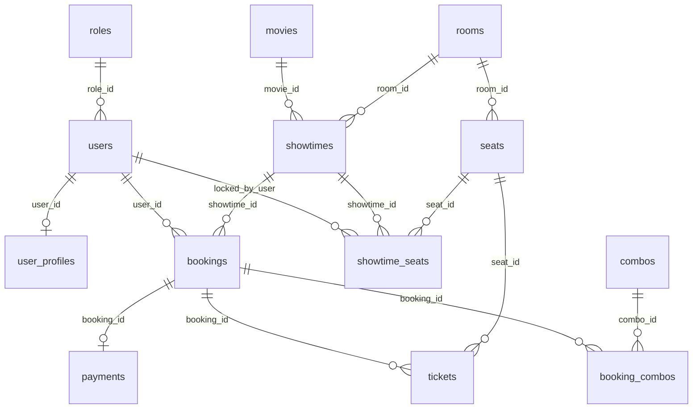
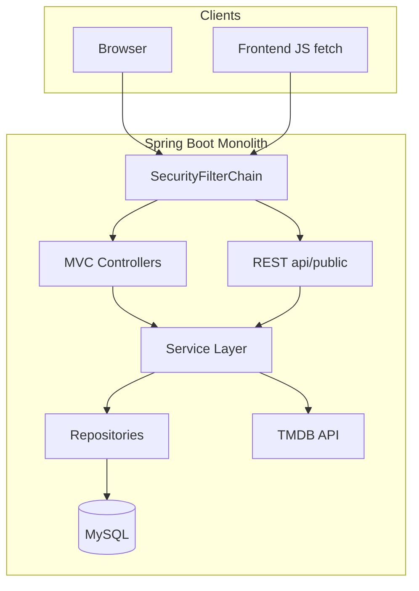
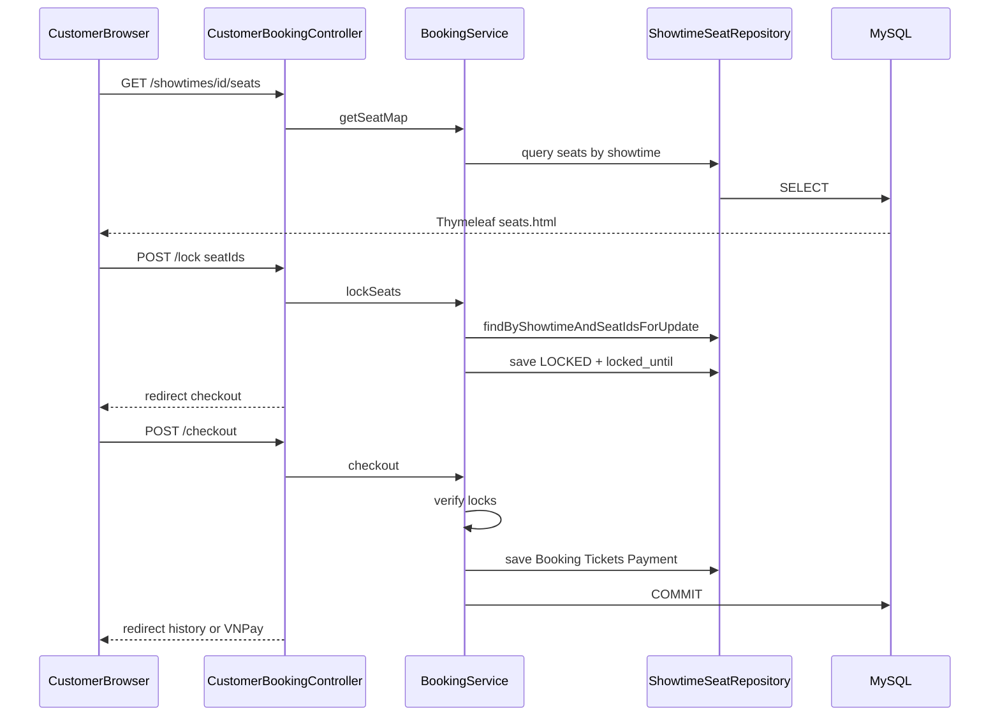

# Báo cáo kiến trúc hệ thống — Smart Cinema Movie Booking

**Dự án:** PTIT_CNTT1_IT210_PROJECTFINAL_CinemaMovieBookingSystem  
**Package gốc:** `com.re.cinemamoviebookingsystem`  
**Cơ sở dữ liệu:** `smart_cinema_db` (MySQL)  
**Cổng mặc định:** `8081` (`src/main/resources/application.properties`)

> Tài liệu này được trích xuất trực tiếp từ mã nguồn và cấu hình trong repository. Không bao gồm suy diễn ngoài phạm vi codebase.

---

## Phần 1: Bóc Tách Khối Ngăn Xếp Công Nghệ

### 1.1 Nền tảng cốt lõi

| Thành phần | Phiên bản / Giá trị | Nguồn |
|------------|---------------------|--------|
| Ngôn ngữ | **Java 21** | `build.gradle` — `JavaLanguageVersion.of(21)` |
| Build tool | **Gradle 9.4.1** | `gradle/wrapper/gradle-wrapper.properties` |
| Framework | **Spring Boot 4.0.6** | `build.gradle` plugin `org.springframework.boot` |
| Dependency BOM | Spring Dependency Management **1.1.7** | `build.gradle` |
| Kiến trúc ứng dụng | **Monolith** — MVC server-rendered + REST JSON song song | `@Controller` + `@RestController` |
| ORM | **Spring Data JPA / Hibernate 7.2.12.Final** | `spring-boot-starter-data-jpa` |
| CSDL | **MySQL** (`mysql-connector-j` **9.7.0**) | `application.properties` |
| View layer | **Thymeleaf 3.1.5.RELEASE** | `spring-boot-starter-thymeleaf` |
| Bảo mật | **Spring Security** (form login, role-based) | `config/SecurityConfig.java` |

**Điểm khởi động:** `PtitCntt1It210ProjectfinalCinemaMovieBookingSystemApplication.java` — `@SpringBootApplication`, `@EnableScheduling`, `@EnableAsync`.

### 1.2 Thư viện phụ trợ và vai trò

| Công nghệ / Thư viện | Phiên bản (resolved BOM) | Vai trò trong dự án |
|----------------------|--------------------------|---------------------|
| `spring-boot-starter-webmvc` | 4.0.6 | HTTP routing, REST API (`/api/public/**`), MVC |
| `spring-boot-starter-validation` | 4.0.6 | Bean Validation trên DTO request (`@Valid`) |
| `spring-boot-starter-security` | 4.0.6 | Phân quyền URL và role |
| `thymeleaf-extras-springsecurity6` | 3.1.5.RELEASE | Điều kiện hiển thị theo role trên template |
| `spring-boot-starter-cache` + Caffeine | **3.2.3** | Cache phản hồi TMDB 30 phút (`config/CacheConfig.java`) |
| `jackson-databind` | **2.21.2** | Deserialize JSON TMDB; đọc nội dung tĩnh classpath |
| Lombok | BOM-managed | Giảm boilerplate entity/DTO/service |
| `spring-boot-devtools` | 4.0.6 | Hot reload khi phát triển |
| JUnit 5 + H2 (test) | BOM-managed | Unit/integration test |
| **TMDB REST API** (HTTP client tự viết) | — | Metadata phim (poster, title, cast…) — không lưu vào DB (`tmdb/client/TmdbClient.java`) |
| **VNPay Sandbox** (logic tự viết) | — | Thanh toán online — không có SDK Maven riêng (`service/VnPaySandboxService.java`) |

### 1.3 Chiến lược schema và dữ liệu (không dùng Flyway/Liquibase)

| Cơ chế | Cấu hình | Hành vi |
|--------|----------|---------|
| Hibernate DDL | `spring.jpa.hibernate.ddl-auto=update` | Tự tạo/sửa bảng từ JPA Entity khi khởi động |
| SQL seed | `spring.sql.init.mode=always` + `classpath:db/seed.sql` | `INSERT IGNORE` — chạy lại an toàn |
| Schema tham chiếu | `src/main/resources/db/schema.sql` | **Không** tự chạy khi boot; dùng import thủ công (MySQL Workbench) |
| Demo seed TMDB | `cinema.demo-seed-on-startup=true` | `config/CinemaDemoSeedRunner.java` |
| Seat lock cleanup | `@Scheduled(fixedRate = 60000)` | `scheduler/SeatLockScheduler.java` → `BookingService.releaseExpiredLocks()` |

### 1.4 Cấu hình nghiệp vụ rạp (`cinema.*`)

Từ `application.properties` và `config/CinemaProperties.java`:

| Thuộc tính | Giá trị | Ý nghĩa |
|------------|---------|---------|
| `seat-lock-minutes` | 15 | Thời gian giữ ghế (LOCKED) |
| `cancel-hours-before` | 24 | Khung hủy vé trước suất |
| `cleaning-buffer-minutes` | 15 | Buffer giữa các suất trong cùng phòng |
| `vip-price-multiplier` | 1.5 | Hệ số giá ghế VIP |
| `max-seats-per-booking` | 8 | Số ghế tối đa mỗi đơn |

### 1.5 Tích hợp TMDB

| Thuộc tính | Mô tả |
|------------|--------|
| `tmdb.base-url` | `https://api.themoviedb.org/3` |
| `tmdb.api-key` / `tmdb.bearer-token` | Từ `application-local.properties` hoặc biến môi trường |
| `tmdb.timeout-ms` | 30000 |
| `tmdb.image-base` | `https://image.tmdb.org/t/p/` |

---

## Phần 2: Hệ Sinh Thái Cơ Sở Dữ Liệu & Lược Đồ Kiến Trúc

### 2.1 Danh sách bảng chính

Đồng bộ giữa `src/main/resources/db/schema.sql` và 14 file Entity JPA trong `entity/`:

| Bảng | Entity | Mô tả ngắn |
|------|--------|------------|
| `roles` | `Role` | ADMIN, STAFF, CUSTOMER |
| `users` | `User` | Tài khoản; `auth_provider` (mặc định LOCAL) |
| `user_profiles` | `UserProfile` | Họ tên, số điện thoại |
| `movies` | `Movie` | **TMDB-first**: chỉ lưu `tmdb_id`, duration, age, status, giá mặc định |
| `rooms` | `Room` | Phòng chiếu |
| `seats` | `Seat` | Ghế vật lý (STANDARD / VIP) |
| `showtimes` | `Showtime` | Suất chiếu (movie + room + thời gian + giá) |
| `showtime_seats` | `ShowtimeSeat` | Trạng thái ghế theo suất (AVAILABLE / LOCKED / BOOKED) |
| `combos` | `Combo` | Combo bắp nước |
| `bookings` | `Booking` | Đơn đặt vé |
| `tickets` | `Ticket` | Vé từng ghế + `ticket_code` (UUID) |
| `booking_combos` | `BookingCombo` | Khóa tổ hợp (booking_id, combo_id) |
| `payments` | `Payment` | Quan hệ 1-1 với booking; VNPay hoặc quầy |

### 2.2 Sơ đồ quan hệ cốt lõi



### 2.3 Ánh xạ quan hệ JPA chi tiết

| Entity | Quan hệ | Đối tượng liên kết |
|--------|---------|-------------------|
| `User` | `@ManyToOne(EAGER)` | `Role` |
| `User` | `@OneToOne(mappedBy, cascade=ALL)` | `UserProfile` |
| `Room` | `@OneToMany(mappedBy, cascade=ALL)` | `Seat` |
| `Seat` | `@ManyToOne` | `Room` |
| `Showtime` | `@ManyToOne` | `Movie`, `Room` |
| `ShowtimeSeat` | `@ManyToOne` | `Showtime`, `Seat`, `User` (lock) |
| `Booking` | `@ManyToOne` | `User`, `Showtime` |
| `Booking` | `@OneToMany(mappedBy)` | `Ticket`, `BookingCombo` |
| `Booking` | `@OneToOne(mappedBy)` | `Payment` |
| `BookingCombo` | `@EmbeddedId` + `@MapsId` | `Booking`, `Combo` |
| `Ticket` | `@ManyToOne` | `Booking`, `Seat` |
| `Payment` | `@OneToOne` | `Booking` |

### 2.4 Ràng buộc nghiệp vụ quan trọng

- **Movie TMDB-first:** `movies.tmdb_id` UNIQUE; không có cột `title` / `poster` trong DB — metadata hiển thị lấy từ TMDB API.
- **Showtime conflict:** index `idx_showtimes_conflict` trên `(room_id, start_time, end_time)`.
- **Seat lock TTL:** `showtime_seats.locked_until` + index `idx_showtime_seats_ttl`.
- **Cascade:** xóa `room` → xóa `seats`; xóa `showtime` → xóa `showtime_seats`; xóa `booking` → xóa `tickets`, `booking_combos`, `payment`.
- **Enum domain** (`enums/`): `BookingStatus`, `SeatStatus`, `ShowtimeStatus`, `PaymentStatus`, `PhysicalSeatType`, `PaymentMode`, `MovieStatus`.

### 2.5 Dữ liệu ngoài MySQL (classpath JSON)

Không map JPA — đọc qua `service/StaticContentService.java`:

| File | Nội dung |
|------|----------|
| `database/promotion.json` | Khuyến mãi |
| `database/event.json` | Tin tức |
| `database/festival.json` | Lễ hội |

Thư mục `src/main/resources/database/` còn chứa `movies.json`, `rooms.json`, `seats.json`, `user.json` (legacy/reference). Seed chính cho runtime là `db/seed.sql`.

### 2.6 Kết nối cơ sở dữ liệu

| Thuộc tính | Giá trị |
|------------|---------|
| URL | `jdbc:mysql://localhost:3306/smart_cinema_db?createDatabaseIfNotExist=true&useSSL=false&serverTimezone=Asia/Ho_Chi_Minh` |
| Driver | `com.mysql.cj.jdbc.Driver` |
| DDL | Hibernate `ddl-auto=update` |
| Seed | `spring.sql.init.data-locations=classpath:db/seed.sql` |

> **Bảo mật:** Thông tin đăng nhập DB nên đặt trong `application-local.properties` (gitignored) hoặc biến môi trường, không commit plaintext vào báo cáo hoặc Git.

---

## Phần 3: Chức Năng Cây Thư Mục Và Tác Vụ Tệp Tin

### 3.1 Directory Tree (rút gọn)

```
PTIT_CNTT1_IT210_PROJECTFINAL_CinemaMovieBookingSystem/
├── build.gradle, settings.gradle, gradlew*
├── gradle/wrapper/
├── docs/                              # tài liệu dự án (bao gồm báo cáo này)
├── scripts/                           # tiện ích Python/HTML (không phải runtime)
└── src/
    ├── main/
    │   ├── java/com/re/cinemamoviebookingsystem/
    │   │   ├── PtitCntt1It210...Application.java
    │   │   ├── api/                   # REST công khai + ApiErrorResponse
    │   │   ├── config/                # Security, Cache, Locale, Seed, MVC
    │   │   ├── controller/            # MVC theo role (admin/staff/customer/auth)
    │   │   ├── dto/                   # request/ + response/ (+ catalog/)
    │   │   ├── entity/                # JPA entities
    │   │   ├── enums/
    │   │   ├── exception/
    │   │   ├── repository/            # Spring Data JPA
    │   │   ├── scheduler/
    │   │   ├── security/
    │   │   ├── service/               # logic nghiệp vụ
    │   │   ├── tmdb/                  # client, dto, service TMDB
    │   │   └── util/
    │   └── resources/
    │       ├── application.properties
    │       ├── application-local.properties.example
    │       ├── db/                    # schema.sql, seed.sql
    │       ├── database/              # JSON nội dung tĩnh
    │       ├── messages*.properties   # i18n (vi/en)
    │       ├── static/                # css, js, images
    │       ├── templates/             # Thymeleaf (customer/admin/staff)
    │       └── docs/                  # tài liệu UI nội bộ
    └── test/java/                     # JUnit tests
```

### 3.2 Phân tích theo lớp (từ ngoài vào trong)

| Thư mục / Tệp | Chức năng bao trùm | Tác vụ nghiệp vụ |
|---------------|-------------------|------------------|
| **Root Gradle** | Build và quản lý dependency | Khai báo stack Spring Boot 4 |
| **config/** | Cấu hình hạ tầng | `SecurityConfig`, `CacheConfig`, `LocaleConfig`, `CinemaProperties`, `DataSeeder`, `CinemaDemoSeedRunner`, `WebMvcConfig`, `AsyncConfig` |
| **controller/** | Giao tiếp HTTP (SSR) | Route → `Model` → Thymeleaf view; không truy vấn DB trực tiếp |
| **api/** | Giao tiếp REST JSON | Catalog TMDB + cinema showtimes; `ApiExceptionHandler` |
| **service/** | Logic nghiệp vụ trung tâm | Booking, Showtime, Catalog, Payment, Report, Auth (19 service) |
| **repository/** | Tầng truy cập dữ liệu | Spring Data JPA + custom `@Query` (ví dụ pessimistic lock ghế) |
| **entity/** | Mô hình persistence | Ánh xạ bảng MySQL |
| **dto/** | Hợp đồng dữ liệu | Request validation + Response cho API/UI (40 file DTO) |
| **tmdb/** | Tích hợp ngoài | HTTP client, DTO TMDB, `TmdbCatalogService` |
| **security/** | Xác thực và phân quyền | `CustomUserDetailsService`, `RoleBasedAuthenticationSuccessHandler` |
| **scheduler/** | Tác vụ định kỳ | Giải phóng ghế LOCKED hết hạn |
| **exception/** | Xử lý lỗi | `BusinessException`, `GlobalExceptionHandler`, `ErrorCode` |
| **templates/** | Presentation SSR | `customer/`, `admin/`, `staff/`, `fragments/`, `error/` |
| **static/** | Front-end tĩnh | CSS/JS (`seat-booking.js`, `home.js`, `movie-detail-tmdb.js`, …) |
| **db/** | Schema và seed SQL | Khởi tạo và nạp dữ liệu mẫu CSDL |

### 3.3 Phân loại tệp theo vai trò kiến trúc

| Loại | Ví dụ | Vai trò |
|------|-------|---------|
| Cấu trúc hệ thống | `SecurityConfig`, `CacheConfig`, `application.properties` | Bootstrapping, bảo mật, cache |
| Giao tiếp mạng | `CustomerBookingController`, `PublicCatalogController` | Nhận HTTP, định tuyến |
| Logic nghiệp vụ | `BookingService`, `ShowtimeService`, `CinemaMovieService` | Quy tắc đặt vé, lịch chiếu, import phim |
| Kho dữ liệu | `*Repository`, `entity/*` | Truy vấn và ánh xạ ORM |
| Chuyển đổi dữ liệu | `dto/*`, method `toDto` trong Service | Entity/DTO/API response (không dùng MapStruct) |

**Lưu ý Mapper:** Dự án **không** dùng MapStruct hay lớp `*Mapper` riêng. Chuyển đổi Entity → DTO thực hiện **trực tiếp trong Service** qua Lombok `@Builder` (ví dụ `MovieService.toDto`, `TmdbCatalogService`, `StaffBookingService.toDto`).

### 3.4 Danh sách Service và Repository tương ứng

| Service | Repositories sử dụng |
|---------|---------------------|
| `AuthService` | User, Role |
| `BookingService` | Booking, Showtime, ShowtimeSeat, User, Combo, Payment |
| `BookingHistoryService` | Booking |
| `CinemaCatalogService` | Movie (+ TMDB/Showtime services) |
| `CinemaMovieService` | Movie |
| `MovieService` | Movie |
| `ShowtimeService` | Movie, Room, Showtime, Seat, ShowtimeSeat |
| `ShowtimeScheduleService` | Movie, Room |
| `ShowtimeStatusService` | Showtime, ShowtimeSeat |
| `ProfileService` | User, UserProfile |
| `ReportService` | Booking |
| `StaffBookingService` | Booking, Ticket |
| `VnPaySandboxService` | Booking, Payment, ShowtimeSeat |
| `LookupService` | Room |
| `StaticContentService` | — (classpath JSON) |
| `TmdbHomeCatalogService` | — (orchestration) |
| `EmailNotificationService` | Booking (log only) |
| `HeroBannerService` | — |
| `MovieDisplayService` | — (TMDB) |

---

## Phần 4: Luồng Thực Thi Tổng Thể & Vòng Đời Yêu Cầu

### 4.1 Hai kênh giao tiếp



### 4.2 Luồng đặt vé tiêu biểu (SSR — Customer)

**Chuỗi endpoint** (`controller/customer/CustomerBookingController.java`):

| Bước | HTTP | Handler | Service / Repository |
|------|------|---------|---------------------|
| 1 | `GET /customer/showtimes/{id}/seats` | `seatMap` | `ShowtimeService.getSeatMap` → Showtime + ShowtimeSeat repos |
| 2 | `POST /customer/showtimes/{id}/lock` | `lockSeats` | `BookingService.lockSeats` → pessimistic lock |
| 3 | `GET /customer/showtimes/{id}/checkout` | `checkoutForm` | Hiển thị form + combo |
| 4 | `POST /customer/checkout` | `checkout` | `BookingService.checkout(CheckoutRequest)` |
| 5 | `POST /customer/bookings/{id}/pay-vnpay` | (tùy chọn) | `VnPaySandboxService.createPaymentUrl` |
| 6 | `GET /payment/vnpay-return` | `PaymentController` | `VnPaySandboxService.handleReturn` |



**Logic trung tâm `BookingService.checkout`:**

1. Xác thực số ghế và suất còn bookable.
2. Gọi `lockSeats` và xác minh ghế thuộc về user hiện tại.
3. Tính `ticketTotal` (base_price × VIP multiplier từ `CinemaProperties`).
4. Tính `comboTotal` từ `ComboRepository`.
5. Tạo `Booking`, `Ticket`, `BookingCombo`, `Payment`.
6. `PaymentMode.ONLINE` → `BookingStatus.PAID` ngay; ngược lại `PENDING` (thanh toán quầy).
7. Ghế chuyển `BOOKED` khi PAID; gọi `ShowtimeStatusService.refreshShowtimeStatus`.
8. `EmailNotificationService.sendTicketEmailAsync` — hiện chỉ ghi log (chưa gửi email thật).

**Scheduler:** `SeatLockScheduler` mỗi 60 giây gọi `BookingService.releaseExpiredLocks()` để giải phóng ghế LOCKED quá `seat-lock-minutes`.

### 4.3 Luồng REST catalog (API công khai)

**Security:** `/api/public/**` → `permitAll()` trong `SecurityConfig`.

| Endpoint | Controller | Service | Nguồn dữ liệu |
|----------|------------|---------|---------------|
| `GET /api/public/movies/discover` | `PublicCatalogController` | `TmdbCatalogService` | TMDB (cache Caffeine) |
| `GET /api/public/movies/now-playing` | ↑ | ↑ | TMDB |
| `GET /api/public/movies/upcoming` | ↑ | ↑ | TMDB |
| `GET /api/public/movies/trending` | ↑ | ↑ | TMDB |
| `GET /api/public/movies/search` | ↑ | ↑ | TMDB |
| `GET /api/public/movies/{tmdbId}` | ↑ | ↑ | TMDB |
| `GET /api/public/genres` | ↑ | ↑ | TMDB |
| `GET /api/public/home/bootstrap` | ↑ | `TmdbHomeCatalogService` | DB + TMDB + hero |
| `GET /api/public/home/now-showing` | ↑ | ↑ | DB movies + TMDB enrich |
| `GET /api/public/home/coming-soon` | ↑ | ↑ | DB movies + TMDB enrich |
| `GET /api/public/cinema/movies/{tmdbId}` | `PublicCinemaController` | `TmdbCatalogService` | TMDB |
| `GET /api/public/cinema/movies/{tmdbId}/showtimes` | ↑ | `ShowtimeService.listByTmdbId` | MySQL `showtimes` |

### 4.4 Bảo mật và phân quyền

| Vai trò | Prefix URL | Redirect sau login |
|---------|------------|-------------------|
| ADMIN | `/admin/**` | `/admin/dashboard` |
| STAFF | `/staff/**` | `/staff/dashboard` |
| CUSTOMER | `/customer/**` (sau rule cụ thể) | `/customer/home` |

| Cơ chế | Chi tiết |
|--------|----------|
| Xác thực | Form login `/login`, BCrypt strength **12** |
| Load user | `CustomUserDetailsService` → `UserRepository.findByUsername` |
| Authority | `ROLE_` + `role.roleName` (ADMIN / STAFF / CUSTOMER) |
| Method security | `@EnableMethodSecurity`, `@PreAuthorize` trên `AdminMovieController` |
| Guest (permitAll) | Catalog, movie detail, calendar, promotions, news, festival, `GET` seat map |
| Yêu cầu CUSTOMER | Booking, checkout, profile, lịch sử đơn |

### 4.5 Luồng Admin và Staff

| Actor | Luồng | Controller → Service → Repository |
|-------|-------|-----------------------------------|
| Admin | Import phim TMDB, tạo lịch mẫu | `AdminMovieController` → `CinemaMovieService.publishToCinema` → `MovieRepository` + `ShowtimeScheduleService` |
| Admin | Đồng bộ runtime TMDB | `POST /admin/movies/{id}/sync-tmdb` → `CinemaMovieService.refreshRuntimeFromTmdb` |
| Admin | Tạo suất thủ công | `AdminShowtimeController` → `ShowtimeService.createShowtime` |
| Admin | Báo cáo doanh thu | `AdminReportController` → `ReportService` → `BookingRepository` aggregates |
| Staff | Tra cứu vé | `StaffController` → `StaffBookingService` (booking ID / ticket code) |
| Staff | Xác nhận thanh toán quầy | `StaffController` → `BookingService.confirmPaymentAtCounter` |
| Staff | In vé | `GET /staff/bookings/{id}/print` |

### 4.6 Ba tầng dữ liệu phim

| Tầng | Lưu trữ | Trách nhiệm |
|------|---------|-------------|
| TMDB API | External HTTP | Title, poster, cast, trailer, genre |
| `movies` table | MySQL | `tmdb_id`, duration, age_label, status, giá admin |
| Thymeleaf + static JS | Browser | Render UI; fetch `/api/public` cho catalog động |

### 4.7 Chuyển đổi DTO và vỏ bọc phản hồi

| Kênh | Cơ chế | Ví dụ |
|------|--------|-------|
| REST API | JSON body trực tiếp từ DTO | `MovieCatalogDetailDto`, `HomeBootstrapResponseDto` |
| REST lỗi | `ApiErrorResponse` `{ status, message }` | `ApiExceptionHandler` |
| SSR | `Model` attributes + Thymeleaf | `seatMap`, `showtimeDays`, flash attributes |
| SSR lỗi nghiệp vụ | Redirect `/error/business` | `GlobalExceptionHandler` + `BusinessException` |

### 4.8 Đăng ký và hồ sơ người dùng

| Endpoint | Luồng |
|----------|-------|
| `GET/POST /register` | `AuthController` → `AuthService.register` → User + Role CUSTOMER |
| `GET/POST /customer/profile` (và staff/admin tương ứng) | `ProfileController` → `ProfileService` → UserProfile |

---

## Phụ lục A: Ma trận Controller MVC chính

| Controller | Base path | Vai trò |
|------------|-----------|---------|
| `CustomerHomeController` | `/customer` | Trang chủ |
| `CustomerCatalogController` | `/customer` | Danh mục phim |
| `CustomerMovieController` | `/customer` | Chi tiết phim, lịch |
| `CustomerBookingController` | `/customer` | Đặt vé, checkout, lịch sử |
| `CustomerContentController` | `/customer` | Promotions, news, festival |
| `CustomerLanguageController` | `/customer` | Đổi ngôn ngữ |
| `AuthController` | `/` | Login, register |
| `ProfileController` | multi | Hồ sơ theo role |
| `AdminDashboardController` | `/admin` | Dashboard |
| `AdminMovieController` | `/admin/movies` | Quản lý phim |
| `AdminShowtimeController` | `/admin/showtimes` | Quản lý suất |
| `AdminReportController` | `/admin/reports` | Báo cáo |
| `StaffController` | `/staff` | Tra cứu, xác nhận vé |
| `PaymentController` | `/payment` | Callback VNPay |
| `ErrorPageController` | `/error` | Trang lỗi |

## Phụ lục B: Repository (Spring Data JPA)

`BookingRepository`, `ComboRepository`, `MovieRepository`, `PaymentRepository`, `RoleRepository`, `RoomRepository`, `SeatRepository`, `ShowtimeRepository`, `ShowtimeSeatRepository`, `TicketRepository`, `UserProfileRepository`, `UserRepository`.

---

*Tài liệu sinh từ phân tích codebase — Smart Cinema Movie Booking System.*
