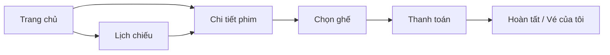

# Kế hoạch UI/UX toàn diện — Smart Cinema

**Mục tiêu:** Nâng trải nghiệm người dùng lên mức “thoải mái nhất có thể” trên toàn bộ giao diện (Khách hàng → Đặt vé → Sau mua; Admin; Staff).  
**Cơ sở:** Phân tích codebase Thymeleaf + CSS module + JS hiện có (`UI_IMPLEMENTATION_PLAN.md`, `UI_CSS_STRUCTURE.md`).  
**Ngày lập:** 2026-05-19

---

## 0. Tóm tắt điều hành

| Khía cạnh | Hiện trạng | Mục tiêu |
|-----------|------------|----------|
| Độ hoàn thiện UI | Khách ~80–90%, Admin/Staff ~85% | Đồng nhất 95%+ trên mọi màn |
| Kiến trúc front-end | CSS rời từng trang + `theme.css` + Bootstrap CDN | Design system thống nhất (tokens + components) |
| Luồng đặt vé | Đã có 3 bước, sticky bar, countdown, guide lần đầu | Giảm friction, tăng tin cậy & tốc độ |
| Mobile | Responsive có; vài bảng/form cần polish | Mobile-first, thumb-friendly |
| Accessibility | Một phần `aria-*`, guide overlay | WCAG 2.1 AA mục tiêu tối thiểu |

**Chiến lược:** Không “làm lại từ đầu” — **chuẩn hóa + polish + đo lường** trên nền NCC đã có.

---

## 1. Nguyên tắc UX (kim chỉ nam)

1. **3 giây hiểu được** — Mỗi màn trả lời ngay: *Tôi đang ở đâu? Làm gì tiếp?*
2. **Một hành động chính (CTA)** — Mỗi viewport chỉ nổi bật 1 nút quan trọng (Đặt vé, Tiếp tục, Thanh toán).
3. **Phản hồi tức thì** — Mọi click có loading/success/error rõ ràng; không để user đoán.
4. **An toàn khi đặt vé** — Countdown, tóm tắt ghế/giá luôn hiển thị; xác nhận trước hành động phá hủy.
5. **Mobile-first** — 70%+ người dùng rạp dùng điện thoại; vùng chạm ≥ 44×44px.
6. **Nhất quán thương hiệu** — Màu, font, spacing, card, badge giống nhau trên 15+ màn khách.
7. **Tiếp cận cho mọi người** — Tương phản đủ, keyboard, screen reader, không chỉ dựa màu.

---

## 2. Persona & hành trình ưu tiên

### 2.1 Persona chính

| Persona | Nhu cầu | Pain point cần xử lý |
|---------|---------|----------------------|
| **Khách lần đầu** | Tìm phim → chọn suất → ghế → thanh toán | Không biết thứ tự bước; sợ hết ghế |
| **Khách quen** | Đặt nhanh, xem lại vé | Menu dài; nhiều click |
| **Khách mobile** | Một tay, mạng chậm | Ghế nhỏ; form checkout dài |
| **Staff quầy** | Tra mã vé, in nhanh | Cần màn hình rõ, ít lỗi nhập |
| **Admin** | Import phim, lịch, báo cáo | Tailwind/CDN khác stack khách |

### 2.2 Hành trình vàng (Customer) — cần tối ưu tối đa



**KPI hành trình:** Thời gian hoàn tất đặt vé (guest đã login), tỷ lệ bỏ ở bước ghế/checkout, tỷ lệ lỗi “ghế đã bị đặt”.

---

## 3. Design System — nền tảng giao diện thống nhất

### 3.1 Hiện trạng kỹ thuật

- Font: **Montserrat** (Google Fonts)
- Framework phụ: **Bootstrap 5.3.3** (carousel, alerts)
- Theme: `css/common/theme.css` — light/dark qua `data-theme` + `theme.js`
- CSS khách: module theo trang (`homepage.css`, `seats-booking.css`, …)
- Admin/Staff: **Tailwind CDN** + `admin-movies.css` — **tách biệt** với khách

### 3.2 Hành động: tạo `design-tokens.css` (mới)

Đặt tại `static/css/common/design-tokens.css`, import sau `theme.css`:

| Nhóm token | Ví dụ | Mục đích |
|------------|-------|----------|
| Màu thương hiệu | `--color-primary`, `--color-accent`, `--color-danger` | CTA, link, lỗi |
| Surface | `--surface-elevated`, `--surface-overlay` | Card, modal, sticky bar |
| Typography | `--text-h1` … `--text-caption` | Hierarchy nhất quán |
| Spacing | `--space-1` … `--space-8` (4px grid) | Padding/margin đồng bộ |
| Radius & shadow | `--radius-md`, `--shadow-card` | Card phim, ghế |
| Motion | `--duration-fast`, `--ease-out` | Hover, transition |
| Z-index | `--z-header`, `--z-sticky`, `--z-modal` | Tránh chồng lớp |

**Accent đề xuất (giữ DNA NCC):** header navy `#0d1b2a`, accent vàng/cam cho CTA đặt vé (đối chiếu poster rạp).

### 3.3 Thư viện component dùng chung (CSS + fragment Thymeleaf)

| Component | Fragment / class | Dùng ở |
|-----------|------------------|--------|
| Button primary/secondary/ghost | `fragments/ui/button.html` | Toàn site khách |
| Alert (success/warning/error/info) | `ui-alert` | Form, booking |
| Badge trạng thái vé | `ui-badge--paid`, `--pending` | bookings, staff |
| Card phim | Chuẩn hóa `home-movie-card` + `movie-cards.css` | home, catalog, calendar |
| Skeleton loader | `ui-skeleton` | TMDB load chậm |
| Empty state | `ui-empty` + CTA | lịch sử vé, tìm kiếm |
| Modal xác nhận | `ui-confirm-modal` | checkout, hủy vé |
| Toast thông báo | `ui-toast` (thay flash-only) | sau lock/checkout |

### 3.4 Chuẩn hóa Admin/Staff (giai đoạn sau)

- Map token Tailwind → cùng palette với khách (primary, surface, text)
- Sidebar/header admin dùng cùng logo, spacing, trạng thái active như header khách

---

## 4. Ma trận cải tiến theo màn hình

### 4.1 Khách hàng — Discovery (Trang chủ, Catalog, Lịch)

| Màn | File chính | Cải tiến UX | Độ ưu tiên |
|-----|------------|-------------|------------|
| Trang chủ | `home.html`, `homepage.css`, `home.js` | Hero: CTA “Đặt vé ngay” rõ; lazy-load poster; skeleton khi TMDB chậm; quick-nav sticky trên mobile | P0 |
| Tìm/lọc | `home.js`, catalog | Debounce search 300ms; chip thể loại; “Xóa bộ lọc”; kết quả rỗng có gợi ý phim hot | P0 |
| Lịch chiếu | `calendar.html`, `calendar.css` | Lọc theo ngày/phòng/format; highlight “suất sắp chiếu”; one-tap vào ghế | P1 |
| Catalog | `catalog.html` | Đồng bộ card với home; infinite scroll hoặc “Xem thêm” thay reload | P2 |

### 4.2 Khách hàng — Quyết định (Chi tiết phim)

| Màn | File | Cải tiến UX | Ưu tiên |
|-----|------|-------------|---------|
| Chi tiết phim | `movie-detail.html`, `movie-detail-tmdb.js` | Tab suất: sticky khi scroll; slot sold-out disabled + tooltip; trailer modal focus trap; nút “Chọn ghế” floating trên mobile | P0 |
| Đổi ngôn ngữ | header | Giữ VI/EN; đảm bảo title phim TMDB đổi theo `appLang` không nhảy layout | P1 |

### 4.3 Khách hàng — Conversion (Chọn ghế → Thanh toán → Vé)

| Màn | File | Cải tiến UX | Ưu tiên |
|-----|------|-------------|---------|
| Chọn ghế | `seats.html`, `seat-booking.js`, `seats-booking.css` | **P0 toàn bộ luồng** |
| | | Đồng bộ countdown với `locked_until` server (hiện JS đếm từ 15 phút cố định) |
| | | Ghế: hover/focus rõ; legend STANDARD/VIP/BOOKED; zoom pinch trên mobile |
| | | Sticky bar: danh sách ghế dạng chip có thể xóa từng ghế |
| | | Disabled submit đến khi ≥1 ghế; rung nhẹ (haptic CSS) khi vượt max 8 |
| Thanh toán | `checkout.html`, `payment.css` | Tóm tắt đơn collapsible; PT rõ ràng (Online vs Quầy); modal confirm trước POST |
| | | Hiển thị thời gian còn lock; link “Sửa ghế” luôn visible |
| Hoàn tất | `booking-detail.html`, `ticket.css` | Animation success; QR/mã vé copy 1 tap; nút “Về trang chủ” + “Đặt thêm” |
| Vé của tôi | `bookings.html` | Filter tab: Tất cả / Chờ TT / Đã TT / Đã hủy; card view trên mobile thay bảng |
| Hủy vé | booking-detail | Confirm + lý do; hiển thị policy `cancel-hours-before` | P1 |

### 4.4 Khách hàng — Nội dung & tài khoản

| Màn | Cải tiến | Ưu tiên |
|-----|-----------|---------|
| KM / Tin / Festival | Card đồng nhất; breadcrumb; share link | P2 |
| Bảng giá | Bảng responsive; anchor link từ checkout | P2 |
| Đăng nhập/Đăng ký | `auth.css` — show/hide password; lỗi field-level; remember me | P1 |
| Hồ sơ | Avatar placeholder; validate SĐT; toast lưu thành công | P2 |

### 4.5 Admin & Staff

| Màn | Cải tiến | Ưu tiên |
|-----|-----------|---------|
| Dashboard admin | Chart đọc được; KPI card click-through | P2 |
| Quản lý phim | Bước import TMDB wizard 3 bước; preview poster trước publish | P1 |
| Tạo suất | Date/time picker thân thiện; cảnh báo trùng phòng (dựa index conflict) | P1 |
| Staff tra cứu | Ô search lớn; scan-friendly; kết quả highlight mã vé | P0 (staff) |
| In vé | Print CSS tối ưu A5; mã QR vé | P1 |

---

## 5. Cải tiến xuyên suốt (Cross-cutting)

### 5.1 Navigation & wayfinding

- **Breadcrumb** trên: Chi tiết phim → Chọn ghế → Thanh toán (bổ sung `fragments/customer/breadcrumb.html`)
- **Header:** thu gọn menu mobile; đóng menu khi chọn link; `aria-expanded` sync
- **Footer:** link nhanh Điều khoản, Hỗ trợ, Hotline (placeholder nếu chưa có backend)
- **Active state:** mở rộng rule `th:classappend` cho `/customer/catalog`, `/customer/movies`

### 5.2 Trạng thái tải & lỗi

| Tình huống | Giải pháp UX |
|------------|--------------|
| TMDB timeout | Skeleton + retry button + fallback “Phim tại rạp” từ DB |
| Ghế bị mất khi lock | Toast + refresh seat map; giữ ghế còn available |
| Session hết hạn | Redirect login + `returnUrl` |
| Lỗi nghiệp vụ | `GlobalExceptionHandler` — message thân thiện + mã lỗi nhỏ cho support |
| Mạng chậm | Disable double-submit trên form checkout/lock |

### 5.3 Micro-interactions

- Transition 150–200ms trên card hover, tab suất, pill giờ chiếu
- `prefers-reduced-motion`: tắt animation nặng
- Success checkmark sau checkout (CSS only, không bắt buộc Lottie)
- Seat select: scale nhẹ + border accent

### 5.4 Onboarding & trợ giúp

**Đã có:** `ui-only.js` — guide overlay (`ncc_guide_*_v1`) cho home/seats/checkout.

**Nâng cấp:**

- Nút “?” cố định góc màn hình → mở lại guide
- Tooltip ngắn trên legend ghế (lần đầu vào seats)
- Trang “Hướng dẫn đặt vé” tĩnh (1 scroll) link từ footer

### 5.5 Accessibility (a11y)

| Hạng mục | Hành động |
|----------|-----------|
| Keyboard | Tab order logic trên seat grid; Enter chọn ghế |
| Focus | `:focus-visible` rõ trên mọi interactive |
| Color | Tỷ lệ tương phản ≥ 4.5:1 cho text; không chỉ đỏ/xanh cho trạng thái ghế |
| Screen reader | `aria-live` cho countdown & tổng tiền; label ghế “Hàng B ghế 5, VIP, trống” |
| Dark mode | Kiểm tra ghế/booking bar trong `[data-theme=dark]` |

### 5.6 Performance cảm nhận (perceived)

- `preconnect` TMDB images (đã có fonts)
- `loading="lazy"` poster phim dưới fold
- Giảm số file CSS per page: gom `movie-detail-page` + `movie-details` nếu trùng
- Defer non-critical JS; giữ `theme.js` defer

### 5.7 i18n

- Rà soát `messages.properties` / `messages_en.properties` — không hardcode tiếng Việt trong JS (đã có `data-label-*` trên seats — nhân rộng)
- Layout không vỡ khi text EN dài hơn (header, nút CTA)

---

## 6. Lộ trình triển khai (6 sprint × ~1 tuần)

### Sprint 0 — Design System & nền (Tuần 1)

| # | Task | Deliverable |
|---|------|-------------|
| 0.1 | Tạo `design-tokens.css` + import trong `head.html` | Tokens màu/spacing/type |
| 0.2 | Refactor `base.css` dùng tokens | Buttons, alerts, forms chuẩn |
| 0.3 | Fragment `ui-button`, `ui-alert`, `ui-empty` | Tái sử dụng Thymeleaf |
| 0.4 | Document component trong `docs/UI_COMPONENTS.md` | Cho team đồng bộ |

### Sprint 1 — Luồng đặt vé (Tuần 2) — **ROI cao nhất**

| # | Task |
|---|------|
| 1.1 | Ghế: countdown sync server, legend, chip xóa ghế, double-submit guard |
| 1.2 | Checkout: confirm modal, lock timer visible, tổng tiền realtime ổn định |
| 1.3 | Booking detail: success state + copy mã vé |
| 1.4 | Breadcrumb + booking steps clickable (disabled bước chưa tới) |

### Sprint 2 — Discovery & Mobile (Tuần 3)

| # | Task |
|---|------|
| 2.1 | Home: skeleton, CTA hero, quick-nav polish |
| 2.2 | Movie detail: sticky showtime + floating “Đặt vé” |
| 2.3 | Calendar: filter + empty state |
| 2.4 | QA responsive 375px / 768px / 1280px |

### Sprint 3 — Tin cậy & lỗi (Tuần 4)

| # | Task |
|---|------|
| 3.1 | Toast system thay flash-only |
| 3.2 | Error/empty states đồng nhất mọi màn |
| 3.3 | TMDB fallback UI |
| 3.4 | Auth forms field-level validation UI |

### Sprint 4 — Vé của tôi & nội dung (Tuần 5)

| # | Task |
|---|------|
| 4.1 | Bookings: tab filter + card mobile |
| 4.2 | Hủy vé UX + policy text |
| 4.3 | News/promo/festival card đồng nhất |
| 4.4 | Onboarding “?” + trang hướng dẫn |

### Sprint 5 — Admin/Staff & a11y (Tuần 6)

| # | Task |
|---|------|
| 5.1 | Staff lookup P0 polish |
| 5.2 | Admin import wizard |
| 5.3 | a11y audit + fix focus/contrast |
| 5.4 | `prefers-reduced-motion`, dark mode QA toàn site |

---

## 7. Ma trận ưu tiên (Impact × Effort)

```
Impact cao, Effort thấp (Làm trước):
  - Toast + chống double-submit checkout
  - Breadcrumb đặt vé
  - Copy mã vé
  - Staff search box lớn

Impact cao, Effort cao:
  - Design tokens + refactor CSS
  - Countdown sync server
  - Bookings card view mobile

Impact thấp, Effort thấp:
  - Animation success nhẹ
  - Footer links

Impact thấp, Effort cao (Hoãn):
  - Admin full design system parity
  - Infinite scroll catalog
```

---

## 8. Checklist chất lượng trước khi release mỗi sprint

- [ ] Test trên Chrome mobile + Safari iOS
- [ ] Keyboard-only đặt được 1 vé test
- [ ] Dark mode: ghế, header, sticky bar đọc được
- [ ] Không regression CSRF form POST
- [ ] i18n VI/EN không overflow header
- [ ] Lighthouse Accessibility ≥ 85 (trang seats + checkout)
- [ ] Thời gian từ chọn ghế → checkout < 3 tap (user đã login)

---

## 9. Đo lường thành công

| Metric | Cách đo | Mục tiêu |
|--------|---------|----------|
| Task completion rate đặt vé | Analytics / log (booking created / seats viewed) | +15% sau Sprint 1 |
| Bounce tại trang ghế | Session flow | −20% |
| Thời gian trung bình checkout | Timestamp lock → payment | −30 giây |
| Lỗi “ghế đã bị đặt” | `ErrorCode.SEAT_TAKEN` count | −25% |
| SUS score (khảo sát 5 user) | Survey sau Sprint 3 | ≥ 80/100 |
| a11y violations | axe DevTools | 0 critical |

---

## 10. Rủi ro & giảm thiểu

| Rủi ro | Giảm thiểu |
|--------|------------|
| Refactor CSS gây vỡ layout | Sprint 0 chỉ thêm tokens; migrate từng file; screenshot regression |
| Tailwind admin khác stack khách | Sprint 5 riêng; không block khách |
| Countdown lệch server | API nhỏ `GET /api/public/showtimes/{id}/lock-status` (optional backend) |
| Scope creep | Bám ma trận P0/P1; P2 sau khi demo PTIT |

---

## 11. File cần chạm (tham chiếu triển khai)

### CSS

- `static/css/common/design-tokens.css` *(mới)*
- `static/css/customer/base.css`, `theme.css`, `header.css`
- `static/css/customer/seats-booking.css`, `payment.css`, `ticket.css`
- `static/css/customer/homepage.css`, `movie-detail-page.css`, `calendar.css`

### HTML / Thymeleaf

- `templates/fragments/customer/*` — head, header, booking-steps, breadcrumb *(mới)*
- `templates/customer/seats.html`, `checkout.html`, `booking-detail.html`, `home.html`, `movie-detail.html`, `bookings.html`

### JavaScript

- `static/js/seat-booking.js`, `ui-only.js`, `home.js`, `movie-detail-schedule.js`
- *(mới)* `static/js/ui-toast.js`, `static/js/checkout-summary.js`

### i18n

- `messages.properties`, `messages_en.properties`

---

## 12. Kết luận

Dự án **đã có nền UI NCC mạnh** (~85%). Để đạt trải nghiệm “thoải mái nhất”, cần tập trung **Sprint 1 (luồng đặt vé)** và **Design System (Sprint 0)** trước khi trang trí thêm các màn phụ. Mọi thay đổi nên giữ kiến trúc Thymeleaf + CSS module hiện tại, tránh rewrite sang SPA trừ khi có yêu cầu riêng.

**Bước tiếp theo đề xuất:** Bắt đầu Sprint 0 — tạo `design-tokens.css` và polish trang `seats.html` + `checkout.html` (ROI cao nhất cho người dùng cuối).

---

*Tài liệu bổ sung cho `UI_IMPLEMENTATION_PLAN.md` và `ARCHITECTURE_REPORT.md`.*
